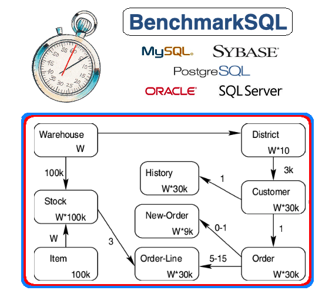

# BenchmarkSQL

BenchmarkSQL은 Java로 구현된 JDBC를 사용하여 SQL 데이터베이스를 스트레스 테스트하는 도구이다.
전체 아키텍처는 시뮬레이션된 터미널, 사용자와 애플리케이션 스레드를 처리하는 일fus의 데이터 구조, 대기열과 스레드 그룹으로 이루어져 있다.

해당 아키텍처를 통해 BenchmarkSQL은 테스트 드라이버 자체의 작업 스케줄러를 Overwhelming하지 않고도 최대 수천 개의 웨어하우스까지 TPC-C 구성을 구동할 수 있다.



# How to run

## BenchmarkSQL 실행 지침

### 요구사항

JDK8이 요구된다.

### 사용자와 DB 생성

RDBMS에 따라 DB를 생성하고 DB에 접근하기 위한 사용자를 생성해야 한다.

각 RDBMS의 실행 방법에서 이 프로세스에 대한 세부 정보를 확인할 수 있다.

### BenchmarkSQL 소스 코드 컴파일

소스에서 jar 파일을 빌드하는 방법은 빌드 섹션을 참조하면 된다.

### Benchmark 구성 파일 생성

Maven이 생성한 `target` 디렉터리 하위의 `run` 디렉터리로 변경하고 RDBMS의 속성 파일을 복사한 다음 시스템 설정과 원하는 크기 조정에 맞게 복사본을 편집한다.

```bash
cd target/run
cp sample.RDBMS.properties my.properties
vi my.properties
```

제공된 예제 구성은 설정 기능을 테스트하기 위한 것이다.
BenchmarkSQL은 DB에 연결하고 트랜잭션을 실행할 수 있다.

BenchmarkSQL DB의 초기 크기는 구성된 웨어하우스 당 약 100MB이다.
기본 설정은 서버의 물리적 RAM의 2~5배에 달하는 DB이다.

동시 DB 연결(구성 파라미터 `terminals`)의 수는 CPU 스레드 수의 약 2~6배여야 한다.

벤치마크 실행은 일반적으로 몇 시간 동안 수행된다.
위 DB 크기에서 안정된 상테에 도달하고 검사점과 진공화 같은 DB의 모든 성능 관련 기능이 측정에 포함되는지 확인하는 데 오랜 시간이 걸리기 때문이다.

### 스키마와 초기 DB Load 구축

runDatabaseBuild.sh 스크립트를 구성 파일을 사용하여 실행한다.

```bash
./runDatabaseBuild.sh my.properties
# ------------------------------------------------------------
# Loading SQL file ./sql.common/tableCreates.sql
# ------------------------------------------------------------
create table bmsql_config (
cfg_namevarchar(30) primary key,
cfg_value   varchar(50)
);
create table bmsql_warehouse (
w_id        integer   not null,
w_ytd       decimal(12,2),
[...]
Starting BenchmarkSQL LoadData

driver=org.postgresql.Driver
conn=jdbc:postgresql://localhost:5432/benchmarksql
user=benchmarksql
password=***********
warehouses=30
loadWorkers=10
fileLocation (not defined)
csvNullValue (not defined - using default 'NULL')

Worker 000: Loading ITEM
Worker 001: Loading Warehouse      1
Worker 002: Loading Warehouse      2
Worker 003: Loading Warehouse      3
[...]
Worker 000: Loading Warehouse     30 done
Worker 008: Loading Warehouse     29 done
# ------------------------------------------------------------
# Loading SQL file ./sql.common/indexCreates.sql
# ------------------------------------------------------------
alter table bmsql_warehouse add constraint bmsql_warehouse_pkey
primary key (w_id);
alter table bmsql_district add constraint bmsql_district_pkey
primary key (d_w_id, d_id);
[...]
vacuum analyze;
```

### 구성된 Benchmark 실행

테이블에 필요한 데이터가 있으면 벤치마크를 실행할 수 있다.

```bash
./runBenchmark.sh my.properties
```

벤치마크는 구성된 동시 연결(`terminals`) 수와 트랜잭션 기간과 수에 대해 실행되어야 한다.
벤치마크의 최종 결과는 다음과 같이 보고된다.

```bash
01:58:09,081 [Thread-1] INFO   jTPCC : Term-00,
01:58:09,082 [Thread-1] INFO   jTPCC : Term-00, Measured tpmC (NewOrders) = 179.55
01:58:09,082 [Thread-1] INFO   jTPCC : Term-00, Measured tpmTOTAL = 329.17
01:58:09,082 [Thread-1] INFO   jTPCC : Term-00, Session Start     = 2016-05-25 01:58:07
01:58:09,082 [Thread-1] INFO   jTPCC : Term-00, Session End       = 2016-05-25 01:58:09
01:58:09,082 [Thread-1] INFO   jTPCC : Term-00, Transaction Count = 10
```

### Benchmark 구성 확장

my.properties 파일을 올바른 크기 조정(웨어하우스 수와 `terminals`)으로 변경한다.
트랜잭션 수 사용에서 시간 기반 사용으로 전환한다.

```bash
runTxnsPerTerminal=0
runMins=180
```

필요한 경우 아래를 실행해 DB를 재구축한다.

```bash
./runDatabaseDestroy.sh my.properties
./runDatabaseBuild.sh my.properties
```

그 이후 벤치마크를 다시 실행한다.

### 결과 보고서

BenchmarkSQL은 자세한 성능 통계와 구성한 경우 OS 성능 데이터를 수집한다.
예저 구성 파일의 기본 값은 `my_reselt`로 시작하는 디렉터리이다.

그래프가 포함된 HTML 파일을 생성하려면 `generateReport.sh` 디렉터리 스크립트를 사용한다.
이를 위해서 R이 설치되어 있어야 하며 이는 How to 범위 초기라 현재 다루지 않을 예정이다.

##  Oracle에서 BenchmarkSQL을 실행하기 위한 지침

### 사용자와 DB 생성

`benchmarksql` 사용자를 생성하기 위해 `sysdba`로 `sqlplus`에서 아래 명령을 실행한다.

```sql
sqlplus / as sysdba <<EOF

CREATE USER benchmarksql
IDENTIFIED BY "password"
DEFAULT TABLESPACE USERS
TEMPORARY TABLESPACE TEMP;

GRANT CONNECT TO benchmarksql;
GRANT CREATE PROCEDURE TO benchmarksql;
GRANT CREATE SEQUENCE TO benchmarksql;
GRANT CREATE SESSION TO benchmarksql;
GRANT CREATE TABLE TO benchmarksql;
GRANT CREATE TRIGGER TO benchmarksql;
GRANT CREATE TYPE TO benchmarksql;
GRANT UNLIMITED TABLESPACE TO benchmarksql;

EOF
```

## PostgreSQL에서 BenchmarkSQL을 실행하기 위한 지침

### 사용자와 DB 생성

Unix 사용자 `postgres`는 `psql` 쉘을 사용해 `postgres` DB에 연결하고 `CREATE USER`와 `CREATE DATABASE` 명령을 실행한다.

```sql
psql postgres

CREATE USER benchmarksql WITH ENCRYPTED PASSWORD 'password';
CREATE DATABASE benchmarksql OWNER benchmarksql;

\q
```

## BenchmarkSQL 속성 파일

BenchmarkSQL은 Java 속성 형식의 파일로 구성된다.
매개변수를 로드할 JDBC 드라이버, DB 유형, 연결 자격 증명, 크기 조정 등을 제어한다.

### 드라이버와 연결 매개변수

| 매개변수      | 설명                                                         | 예시                                       |
| ------------- | ------------------------------------------------------------ | ------------------------------------------ |
| `db`          | DB 형식<br />`firebird`, `mariadb`, `oracle`, `postgres`, `transact-sql` 등의 문자열<br />일반 애플리케이션이 이 매개변수를 기반으로 처리하는 SQL 언어에 몇 가지 차이점이 있다.<br /> SQL 언어의 차이점의 예로 `FOR UPDATE`가 있다.<br />`MSSQL`은 SQL 표준 구문만 허용하나 일반 `SELECT`에서 힌트 `WITH`(UPDLOCK)을 지원한다. | `oracle`                                   |
| `driver`      | JDBC 드라이버를 로드할 JDBC 드라이브 클래스 이름             | `org.oracle.Driver`                        |
| `application` | 클라이언트 측 애플리케이션 유형 BenchmarkSQL은 JDBC를 사용하는 Generic 애플리케이션 유형의 모든 DB 유형을 지원한다.<br />`ReadyStatement()`와 비즈니스 로직은 클라이언트에서만 구현된다.<br />대안으로는 `PL/pgSQL`이나 `PL/SQL`로 작성된 저장 프로시저에서 비즈니스 논리를 구현하는 `PostgreSQLStoredProc`와 `OracleStoredProc`이다.<br />BenchmarkSQL 클라이언트는 여전히 모든 화면 입력을 생성하고 이를 DB로 전송한 후 모든 화면 출력을 다시 수신한다.<br />이런 구현의 주요 이점은 애플리케이션과 DB 간 네트워크 왕복 횟수를 줄이는 것이다. | `Generic`                                  |
| `conn`        | JDBC 연결 URI                                                | `jdbc:oracle:thin:@172.16.0.104:1521:orcl` |
| `user`        | DB 사용자 이름                                               | `benchmarksql`                             |
| `password`    | DB 사용자 비밀번호                                           | `benchmarksql`                             |

### 스케일링 매개변수

| 매개변수                    | 설명                                                         | 예시   |
| --------------------------- | ------------------------------------------------------------ | ------ |
| `warehouses`                | 전체 DB 크기 조정 매개변수<br />초기 DB 크기 뿐 아니라 BenchmarkSQL이 시뮬레이션 할 터미널 수에도 영향을 준다. | `2000` |
| `loadworkers`               | 초기 DB 컨텐츠를 생성하는 데 사용되는 병렬 스레드 수<br />DB 서버의 CPU와 I/O 용량을 기반으로 해야 한다. | `8`    |
| `monkeys`                   | 터미널 입출력을 처리하는 데 사용되는 Monkey 스레드 수<br />자세한 내용은 아키텍처를 참고한다. | `8`    |
| `sutThreads`                | 실행할 애플리케이션 스레드 수<br />BenchmarkSQL은 들어오는 요청을 처리하기 위해 많은 병렬 DB 연결을 생성한다. | `80`   |
| `maxDeliveryBGThreads`      | Delivery 트랜잭션의 Background 부분을 처리하도록 허용되는 최대 sutThread 수 | `40`   |
| `maxDeliveryBGPerWarehouse` | 동일한 웨어하우스에 대한 Delivery 트랜잭션의 Background 부분을 처리하도록 허용된 최대 sutThread 수 | `1`    |

Delivery Background 트랜잭션에 대한 참고 사항으로는 TPC-C에는 Delivery라는 벌크 트랜잭션이 있다.
한 `Warehouse`의 각 `District`에서 가장 오래되고 아직 전송되지 않은 `Order`를 선택하여 배송한다.
여기에는 `FOR UPDATE`에서 `New-Order` 테이블에서 10 행을 선택하고 해당 10개의 `Order` 행과 평균 100개 `Order_line` 행 등을 업데이트하는 작업이 포함된다.

이 Background 트랜잭션은 완료하는 데 80초 정도 소요된다.
동일한 `Warehouse`에 속하는 `New-Order` 행을 선택하면 이미 잠금 충돌이 발생하므로 웨어하우스 당 동시 Delivery 트랜잭션 수를 1로 제한하는 것이 기본이다.
`maxDeliveryBGThreads` 매개변수는 응답 시간 제약이 더 엄격한 트랜잭션이 SUT FiFo 큐에서 대기하는 동안 모든 SUT 스레드가 이 트랜잭션 유형으로 바쁜 것을 방지하기 위한 제어 메커니즘이다.

### 타이밍과 테스트 기간 매개변수

| 매개변수                      | 설명                                                         | 예시    |
| ----------------------------- | ------------------------------------------------------------ | ------- |
| `rampupMins`                  | 실제 벤치마크 측정이 시작되기까지 몇 분 지연되는 지<br />이 지연 이전에 실행된 모든 트랜잭션은 통계나 보고서에서 무시된다.<br />DB에 전체 로드 시 레벨 아웃 시간을 제공하려면 이 값이 `rampupTerminalMins` 매개변수 보다 커야 한다. | `30`    |
| `rampupSUTMins`               | SUT 스레드(DB 연결)가 시작되는 기간<br />`rampupTerminalMins`보다 낮거나 같아야 한다. | `15`    |
| `rampupTerminalMins`          | 시뮬레이션된 터미널이 실행되는 기간<br />터미널은 모든 키인과 사고 지연을 수행하므로 일정 시간에 걸쳐 터미널 출시를 분산시키면 0초 만에 0-100이 되는 대신 트랜잭션 부하가 점차 증가한다.<br />이렇게 하면 클라이언트 애플리케이션에 대규모 요청 백로그를 구축하는 대신 캐시를 준비하는 동안 DB가 로드를 따라잡을 수 있는 시간이 제공된다. | `20`    |
| `runMins`                     | 실제 벤치마크 측정 기간<br />이 길이는 적어도 하나의 체크포인트를 포괄할 수 있을 만큼 길어야 한다.<br />DB가 어떻게 작동하는 지 결과를 얻으려면 몇 시간에서 며칠이 권장된다. | `300`   |
| `reportIntervalSecs`          | 테스트 드라이버가 분당 트랜잭션에 대한 현재 평균 수를 보고하는 간격 | `60`    |
| `restartSUTThreadProbability` | SUT 스레드가 교체 실행을 예약하고 요청 완료 후 종료될 확률   | `0.001` |

### 처리량 조정 매개변수

이러한 매개변수를 기본 값 1.0에서 변경하면 벤치마크 결과가 TPC-C 타이밍 요구 사항을 위반하게 된다.

스토리지 크기에 비해 CPU와 메모리 요구 사항 간의 비율이 오래되었다.
오늘날의 DB는 당시의 DB보다 GB 당 훨씬 더 많은 트랜잭션을 처리한다.

다음 매개변수는 사용자가 웨어하우스 당 트랜잭션 빈도를 얼마나 확장할 것인지 제어할 수 있도록 하기 위한 것이였다.
예시에서는 시도된 트랜잭션 속도를 10배 높이는 것을 보여준다.

| 매개변수               | 설명                                                         | 예시  |
| ---------------------- | ------------------------------------------------------------ | ----- |
| `keyingTimeMultiplier` | 키잉은 시뮬레이션 시간이며 사용자는 입력 화면을 채워야 한다.<br />트랜잭션 유형에 따라 고정된 시간(초)이다. | `0.1` |
| `thinkTimeMultiplier`  | Think 시간을 시뮬레이션 시간으로 키잉하는 것과 유사하게 사용자는 출력 화면을 읽고 거래 결과를 처리해야 한다.<br />이는 트랜잭션 시간 당 평균이 정의된 임의 시간이다. | `0.1` |

### 트랜잭션 혼합 파라미터

TPC-C 사양에는 트랜잭션 유형에 대한 최소 비율이 필요하다.

-   43.0% `Payment`
-   43.0% `New-Order`
-   4.0% `Order-Status`
-   4.0% `Stock-Level`
-   4.0% `Delivery`

BenchmarkSQL은 난수 생성기를 사용해 터미널 별로 다음 트랜잭션을 선택한다.
위 문제를 방지하기 위해 필요한 백분율을 조금 더 높게 지정하는 것이 좋다.

| 매개변수            | 설명                       | 예시 |
| ------------------- | -------------------------- | ---- |
| `paymentWeight`     | Payment 트랜잭션 확률      | 43.1 |
| `orderStatusWeight` | Order-Status 트랜잭션 확률 | 4.1  |
| `stockLevelWeight`  | Stock-Level 트랜잭션 확률  | 4.1  |
| `deliveryWeight`    | Delivery 트랜잭션 확률     | 4.1  |

## TPC-C 설명

TPC-C란 트랜잭션 처리 위원회에서 정의한 OLTP 벤치마크이다.
10개의 외래 키 관계로 연결된 9개의 테이블로 구성된다.
`Item` 테이블을 제외한 모든 항목은 DB의 초기 로드 중 생성되는 웨어하우스 수(`W`)에 따라 카디널리티가 확장된다.


이 스키마는 테이블에 다양한 액세스 패턴을 생성하는 5개의 서로 다른 트랜잭션에서 사용된다.

-   `Item`은 읽기 전용이다.
-   `Warehouse`, `District`, `Customer`, `Stock`은 읽기 / 쓰기 가능하다.
-   `New-Order`는 주어진 시간에 약 `W` * 9000개의 행이 있는 대기열과 마찬가지로 삽입 / 읽기 / 삭제 가능하다.
-   `Order`와 `Order-Line`은 삽입을 수신하고 삽입된 모든 행은 시간 지연 업데이트를 가지며 그 이후 행이 오래되어 나중에 자주 읽히지 않을 수 있다.
-   `History`는 삽입 전용이다.

이 작은 스키마와 트랜잭션 프로필 수에 대한 다양한 액세스 패턴 세트와 인상적인 복잡성이다.
이는 TPC-C가 오늘날에도 여전히 가장 중요한 DB 벤치마크 중 하나인 이유 중 하나이다.

>    [Standard specification from TCP](http://tpc.org/tpc_documents_current_versions/pdf/tpc-c_v5.11.0.pdf)