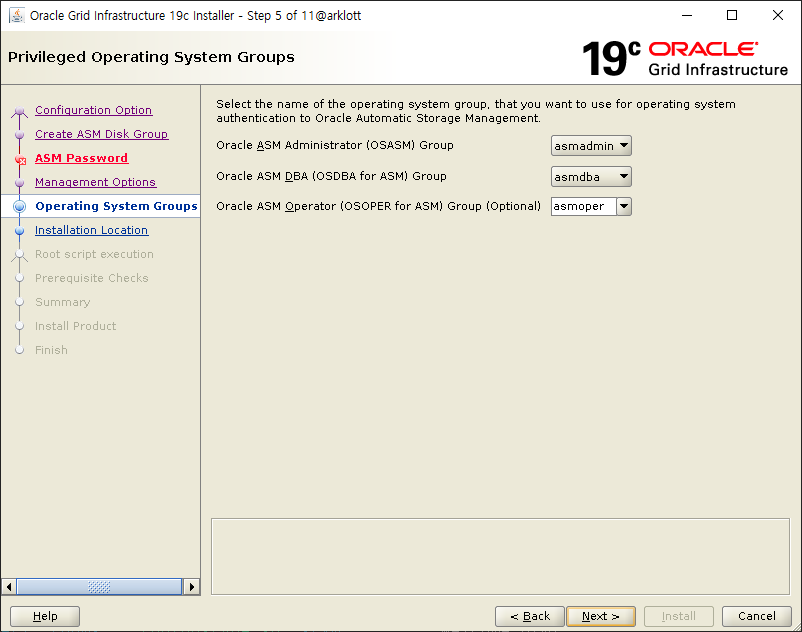
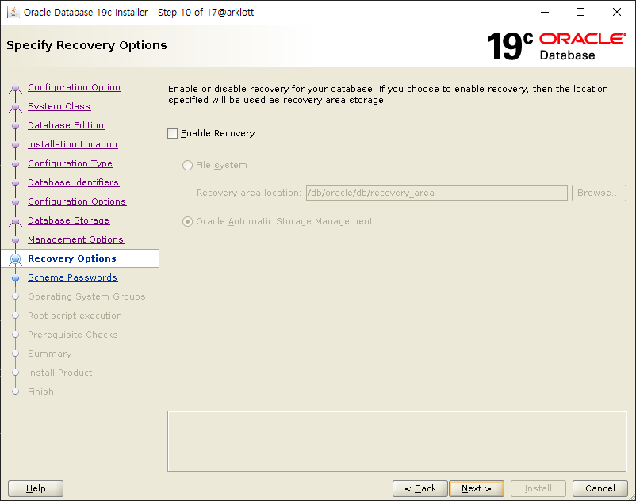

# OPatch

Oracle Server 9.2.0.2부터 Interim Patch(One-Off Patch 즉 Single Patch)를 적용할 때 OPatch라는 도구를 사용한다.
One-Off Patch는 특정 버그에 대한 조치이다.
One-Off Patch의 모음을 PatchSet이라 한다.

Metalink에서는 항상 최신 OPatch Tool을 다운로드 받을 수 있도록 갱신된다.

## OPatch 기능

-   INTERIM PATCH Apply
-   INTERIM PATCH Rollback
-   설치된 INTERIM PATCH와 CONFLICT 여부 점검
-   설치된 Product와 INTERIM PATCH를 보고(Report)

## OPatch 실습

### 환경

| OS       | Memory | GI   | DB   | GI User | DB User |
| -------- | ------ | ---- | ---- | ------- | ------- |
| CentOS 7 | 16G    | 19.3 | 19.3 | grid    | oracle  |

### 목표

Oracle Grid Infrastructure와 Oracle Database를 19.19로 패치한다.

### 필요 파일

-   OPatch 19
    -   p6880880_190000_Linux-x86-64.zip
-   Grid 19.19 PatchSet
    -   p35037840_190000_Linux-x86-64.zip
-   DB 19.19 PatchSet
    -   p35042068_190000_Linux-x86-64.zip

### GI Patch

GI를 새로 까는 것이 개인적으로 편하다고 생각하여 삭제 후 진행 예정이다.

```bash
# GRID_HOME에 GRID 설치 파일 Unzip
unzip LINUX.X64_193000_grid_home.zip

# 기존 OPatch 변경
mv OPatch OPatch_OLD
unzip p6880880_190000_Linux-x86-64.zip

# OPatch 버전 확인
OPatch/opatch version
OPatch Version: 12.2.0.1.40

# GI PatchSet으로 설치(PatchSet을 Unzip한 경로는 GRID_HOME과 다른 경로다.)
unzip p35037840_190000_Linux-x86-64.zip
cd 35037840
pwd
/db/oracle/patch/35037840

# GRID_HOME으로 이동 후 -applyRU 옵션과 위에서 조회한 PatchSet 경로를 파라미터로 gridSetup.sh 진행
./gridSetup.sh -applyRU /db/oracle/patch/35037840

```



### DB Patch

DB 역시 새로 까는 것이 개인적으로 편하여 삭제 후 진행한다.

```bash
# ORACLE_HOME에 DB 설치파일 Unzip
unzip LINUX.X64_193000_db_home.zip

# 기존 OPatch 변경
mv OPatch OPatch_OLD
unzip p6880880_190000_Linux-x86-64.zip

# OPatch 버전 확인
OPatch/opatch version
OPatch Version: 12.2.0.1.40

# DB PatchSet으로 설치
unzip p35042068_190000_Linux-x86-64.zip
cd 35042068
pwd
/db/oracle/patch/35042068

# ORACLE_HOME으로 이동 후 -applyRU 옵션과 위에서 조회한 PatchSet 경로를 파라미터로 runInstaller 실행
./runInstaller -applyRU /db/oracle/patch/35042068
```


