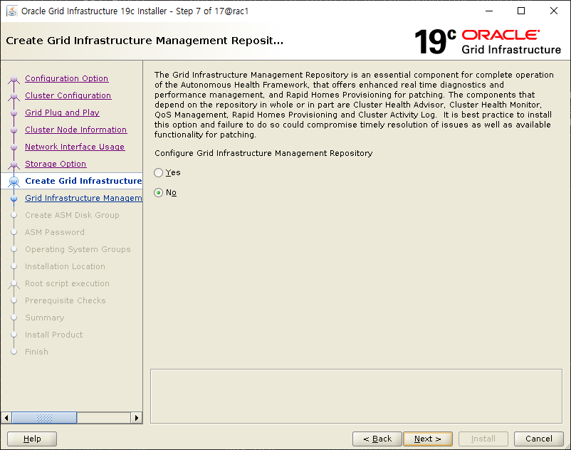

초기 백업 도중 문서 정리

```bash
[+ASM1:/app/grid/oui/prov/resources/scripts]> ./sshUserSetup.sh -user oracle -hosts "rac1 rac2 rac3" -noPromptPassphrase -advanced
The output of this script is also logged into /tmp/sshUserSetup_2023-08-21-15-29-41.log
Hosts are rac1 rac2 rac3
user is oracle
Platform:- Linux
Checking if the remote hosts are reachable
PING rac1 (172.16.0.105) 56(84) bytes of data.
64 bytes from rac1 (172.16.0.105): icmp_seq=1 ttl=64 time=0.013 ms
64 bytes from rac1 (172.16.0.105): icmp_seq=2 ttl=64 time=0.033 ms
64 bytes from rac1 (172.16.0.105): icmp_seq=3 ttl=64 time=0.022 ms
64 bytes from rac1 (172.16.0.105): icmp_seq=4 ttl=64 time=0.016 ms
64 bytes from rac1 (172.16.0.105): icmp_seq=5 ttl=64 time=0.036 ms

--- rac1 ping statistics ---
5 packets transmitted, 5 received, 0% packet loss, time 4005ms
rtt min/avg/max/mdev = 0.013/0.024/0.036/0.009 ms
PING rac2 (172.16.0.106) 56(84) bytes of data.
64 bytes from rac2 (172.16.0.106): icmp_seq=1 ttl=64 time=0.450 ms
64 bytes from rac2 (172.16.0.106): icmp_seq=2 ttl=64 time=0.736 ms
64 bytes from rac2 (172.16.0.106): icmp_seq=3 ttl=64 time=0.537 ms
64 bytes from rac2 (172.16.0.106): icmp_seq=4 ttl=64 time=0.246 ms
64 bytes from rac2 (172.16.0.106): icmp_seq=5 ttl=64 time=0.264 ms

--- rac2 ping statistics ---
5 packets transmitted, 5 received, 0% packet loss, time 4074ms
rtt min/avg/max/mdev = 0.246/0.446/0.736/0.183 ms
PING rac3 (172.16.0.107) 56(84) bytes of data.
64 bytes from rac3 (172.16.0.107): icmp_seq=1 ttl=64 time=0.428 ms
64 bytes from rac3 (172.16.0.107): icmp_seq=2 ttl=64 time=0.749 ms
64 bytes from rac3 (172.16.0.107): icmp_seq=3 ttl=64 time=0.816 ms
64 bytes from rac3 (172.16.0.107): icmp_seq=4 ttl=64 time=0.738 ms
64 bytes from rac3 (172.16.0.107): icmp_seq=5 ttl=64 time=0.252 ms

--- rac3 ping statistics ---
5 packets transmitted, 5 received, 0% packet loss, time 4051ms
rtt min/avg/max/mdev = 0.252/0.596/0.816/0.220 ms
Remote host reachability check succeeded.
The following hosts are reachable: rac1 rac2 rac3.
The following hosts are not reachable: .
All hosts are reachable. Proceeding further...
firsthost rac1
numhosts 3
The script will setup SSH connectivity from the host rac1 to all
the remote hosts. After the script is executed, the user can use SSH to run
commands on the remote hosts or copy files between this host rac1
and the remote hosts without being prompted for passwords or confirmations.

NOTE 1:
As part of the setup procedure, this script will use ssh and scp to copy
files between the local host and the remote hosts. Since the script does not
store passwords, you may be prompted for the passwords during the execution of
the script whenever ssh or scp is invoked.

NOTE 2:
AS PER SSH REQUIREMENTS, THIS SCRIPT WILL SECURE THE USER HOME DIRECTORY
AND THE .ssh DIRECTORY BY REVOKING GROUP AND WORLD WRITE PRIVILEGES TO THESE
directories.

Do you want to continue and let the script make the above mentioned changes (yes/no)?
yes

The user chose yes
User chose to skip passphrase related questions.
Creating .ssh directory on local host, if not present already
Creating authorized_keys file on local host
Changing permissions on authorized_keys to 644 on local host
Creating known_hosts file on local host
Changing permissions on known_hosts to 644 on local host
Creating config file on local host
If a config file exists already at /home/oracle/.ssh/config, it would be backed up to /home/oracle/.ssh/config.backup.
Creating .ssh directory and setting permissions on remote host rac1
THE SCRIPT WOULD ALSO BE REVOKING WRITE PERMISSIONS FOR group AND others ON THE HOME DIRECTORY FOR oracle. THIS IS AN SSH REQUIREMENT.
The script would create ~oracle/.ssh/config file on remote host rac1. If a config file exists already at ~oracle/.ssh/config, it would be backed up to ~oracle/.ssh/config.backup.
The user may be prompted for a password here since the script would be running SSH on host rac1.
Warning: Permanently added 'rac1,172.16.0.105' (ECDSA) to the list of known hosts.
oracle@rac1's password:
Done with creating .ssh directory and setting permissions on remote host rac1.
Creating .ssh directory and setting permissions on remote host rac2
THE SCRIPT WOULD ALSO BE REVOKING WRITE PERMISSIONS FOR group AND others ON THE HOME DIRECTORY FOR oracle. THIS IS AN SSH REQUIREMENT.
The script would create ~oracle/.ssh/config file on remote host rac2. If a config file exists already at ~oracle/.ssh/config, it would be backed up to ~oracle/.ssh/config.backup.
The user may be prompted for a password here since the script would be running SSH on host rac2.
Warning: Permanently added 'rac2,172.16.0.106' (ECDSA) to the list of known hosts.
Done with creating .ssh directory and setting permissions on remote host rac2.
Creating .ssh directory and setting permissions on remote host rac3
THE SCRIPT WOULD ALSO BE REVOKING WRITE PERMISSIONS FOR group AND others ON THE HOME DIRECTORY FOR oracle. THIS IS AN SSH REQUIREMENT.
The script would create ~oracle/.ssh/config file on remote host rac3. If a config file exists already at ~oracle/.ssh/config, it would be backed up to ~oracle/.ssh/config.backup.
The user may be prompted for a password here since the script would be running SSH on host rac3.
Warning: Permanently added 'rac3,172.16.0.107' (ECDSA) to the list of known hosts.
Done with creating .ssh directory and setting permissions on remote host rac3.
Copying local host public key to the remote host rac1
The user may be prompted for a password or passphrase here since the script would be using SCP for host rac1.
oracle@rac1's password:
Done copying local host public key to the remote host rac1
Copying local host public key to the remote host rac2
The user may be prompted for a password or passphrase here since the script would be using SCP for host rac2.
Done copying local host public key to the remote host rac2
Copying local host public key to the remote host rac3
The user may be prompted for a password or passphrase here since the script would be using SCP for host rac3.
Done copying local host public key to the remote host rac3
Creating keys on remote host rac1 if they do not exist already. This is required to setup SSH on host rac1.

Creating keys on remote host rac2 if they do not exist already. This is required to setup SSH on host rac2.

Creating keys on remote host rac3 if they do not exist already. This is required to setup SSH on host rac3.

Updating authorized_keys file on remote host rac1
Updating known_hosts file on remote host rac1
Updating authorized_keys file on remote host rac2
Updating known_hosts file on remote host rac2
Updating authorized_keys file on remote host rac3
Updating known_hosts file on remote host rac3
cat: /home/oracle/.ssh/known_hosts.tmp: No such file or directory
cat: /home/oracle/.ssh/authorized_keys.tmp: No such file or directory
SSH setup is complete.

------------------------------------------------------------------------
Verifying SSH setup
===================
The script will now run the date command on the remote nodes using ssh
to verify if ssh is setup correctly. IF THE SETUP IS CORRECTLY SETUP,
THERE SHOULD BE NO OUTPUT OTHER THAN THE DATE AND SSH SHOULD NOT ASK FOR
PASSWORDS. If you see any output other than date or are prompted for the
password, ssh is not setup correctly and you will need to resolve the
issue and set up ssh again.
The possible causes for failure could be:
1. The server settings in /etc/ssh/sshd_config file do not allow ssh
for user oracle.
2. The server may have disabled public key based authentication.
3. The client public key on the server may be outdated.
4. ~oracle or ~oracle/.ssh on the remote host may not be owned by oracle.
5. User may not have passed -shared option for shared remote users or
may be passing the -shared option for non-shared remote users.
6. If there is output in addition to the date, but no password is asked,
it may be a security alert shown as part of company policy. Append the
additional text to the <OMS HOME>/sysman/prov/resources/ignoreMessages.txt file.
------------------------------------------------------------------------
--rac1:--
Running /usr/bin/ssh -x -l oracle rac1 date to verify SSH connectivity has been setup from local host to rac1.
IF YOU SEE ANY OTHER OUTPUT BESIDES THE OUTPUT OF THE DATE COMMAND OR IF YOU ARE PROMPTED FOR A PASSWORD HERE, IT MEANS SSH SETUP HAS NOT BEEN SUCCESSFUL. Please note that being prompted for a passphrase may be OK but being prompted for a password is ERROR.
Mon Aug 21 15:30:09 KST 2023
------------------------------------------------------------------------
--rac2:--
Running /usr/bin/ssh -x -l oracle rac2 date to verify SSH connectivity has been setup from local host to rac2.
IF YOU SEE ANY OTHER OUTPUT BESIDES THE OUTPUT OF THE DATE COMMAND OR IF YOU ARE PROMPTED FOR A PASSWORD HERE, IT MEANS SSH SETUP HAS NOT BEEN SUCCESSFUL. Please note that being prompted for a passphrase may be OK but being prompted for a password is ERROR.
Mon Aug 21 15:30:12 KST 2023
------------------------------------------------------------------------
--rac3:--
Running /usr/bin/ssh -x -l oracle rac3 date to verify SSH connectivity has been setup from local host to rac3.
IF YOU SEE ANY OTHER OUTPUT BESIDES THE OUTPUT OF THE DATE COMMAND OR IF YOU ARE PROMPTED FOR A PASSWORD HERE, IT MEANS SSH SETUP HAS NOT BEEN SUCCESSFUL. Please note that being prompted for a passphrase may be OK but being prompted for a password is ERROR.
Mon Aug 21 15:30:12 KST 2023
------------------------------------------------------------------------
------------------------------------------------------------------------
Verifying SSH connectivity has been setup from rac1 to rac1
IF YOU SEE ANY OTHER OUTPUT BESIDES THE OUTPUT OF THE DATE COMMAND OR IF YOU ARE PROMPTED FOR A PASSWORD HERE, IT MEANS SSH SETUP HAS NOT BEEN SUCCESSFUL.
Mon Aug 21 15:30:09 KST 2023
------------------------------------------------------------------------
------------------------------------------------------------------------
Verifying SSH connectivity has been setup from rac1 to rac2
IF YOU SEE ANY OTHER OUTPUT BESIDES THE OUTPUT OF THE DATE COMMAND OR IF YOU ARE PROMPTED FOR A PASSWORD HERE, IT MEANS SSH SETUP HAS NOT BEEN SUCCESSFUL.
Mon Aug 21 15:30:12 KST 2023
------------------------------------------------------------------------
------------------------------------------------------------------------
Verifying SSH connectivity has been setup from rac1 to rac3
IF YOU SEE ANY OTHER OUTPUT BESIDES THE OUTPUT OF THE DATE COMMAND OR IF YOU ARE PROMPTED FOR A PASSWORD HERE, IT MEANS SSH SETUP HAS NOT BEEN SUCCESSFUL.
Mon Aug 21 15:30:13 KST 2023
------------------------------------------------------------------------
-Verification from complete-
SSH verification complete.
```


```bash
[+ASM1:/app/grid]> ./runcluvfy.sh stage -pre crsinst -n rac1,rac2,rac3 -osdba dba -orainv oinstall -fixup -method root -networks enp0s3/enp0s8 -verbose
Enter "ROOT" password:

Verifying Physical Memory ...
  Node Name     Available                 Required                  Status
  ------------  ------------------------  ------------------------  ----------
  rac2          15.5125GB (1.6266E7KB)    8GB (8388608.0KB)         passed
  rac1          15.5125GB (1.6266E7KB)    8GB (8388608.0KB)         passed
  rac3          15.5125GB (1.6266E7KB)    8GB (8388608.0KB)         passed
Verifying Physical Memory ...PASSED
Verifying Available Physical Memory ...
  Node Name     Available                 Required                  Status
  ------------  ------------------------  ------------------------  ----------
  rac2          15.0322GB (1.576236E7KB)  50MB (51200.0KB)          passed
  rac1          14.2733GB (1.4966644E7KB)  50MB (51200.0KB)          passed
  rac3          15.0326GB (1.5762876E7KB)  50MB (51200.0KB)          passed
Verifying Available Physical Memory ...PASSED
Verifying Swap Size ...
  Node Name     Available                 Required                  Status
  ------------  ------------------------  ------------------------  ----------
  rac2          2GB (2097148.0KB)         15.5125GB (1.6266E7KB)    failed
  rac1          2GB (2097148.0KB)         15.5125GB (1.6266E7KB)    failed
  rac3          2GB (2097148.0KB)         15.5125GB (1.6266E7KB)    failed
Verifying Swap Size ...FAILED (PRVF-7573)
Verifying Free Space: rac2:/usr,rac2:/var,rac2:/etc,rac2:/sbin,rac2:/tmp ...
  Path              Node Name     Mount point   Available     Required      Status
  ----------------  ------------  ------------  ------------  ------------  ------------
  /usr              rac2          /             13.248GB      25MB          passed
  /var              rac2          /             13.248GB      5MB           passed
  /etc              rac2          /             13.248GB      25MB          passed
  /sbin             rac2          /             13.248GB      10MB          passed
  /tmp              rac2          /             13.248GB      1GB           passed
Verifying Free Space: rac2:/usr,rac2:/var,rac2:/etc,rac2:/sbin,rac2:/tmp ...PASSED
Verifying Free Space: rac1:/usr,rac1:/var,rac1:/etc,rac1:/sbin,rac1:/tmp ...
  Path              Node Name     Mount point   Available     Required      Status
  ----------------  ------------  ------------  ------------  ------------  ------------
  /usr              rac1          /             4.1637GB      25MB          passed
  /var              rac1          /             4.1637GB      5MB           passed
  /etc              rac1          /             4.1637GB      25MB          passed
  /sbin             rac1          /             4.1637GB      10MB          passed
  /tmp              rac1          /             4.1637GB      1GB           passed
Verifying Free Space: rac1:/usr,rac1:/var,rac1:/etc,rac1:/sbin,rac1:/tmp ...PASSED
Verifying Free Space: rac3:/usr,rac3:/var,rac3:/etc,rac3:/sbin,rac3:/tmp ...
  Path              Node Name     Mount point   Available     Required      Status
  ----------------  ------------  ------------  ------------  ------------  ------------
  /usr              rac3          /             13.248GB      25MB          passed
  /var              rac3          /             13.248GB      5MB           passed
  /etc              rac3          /             13.248GB      25MB          passed
  /sbin             rac3          /             13.248GB      10MB          passed
  /tmp              rac3          /             13.248GB      1GB           passed
Verifying Free Space: rac3:/usr,rac3:/var,rac3:/etc,rac3:/sbin,rac3:/tmp ...PASSED
Verifying User Existence: oracle ...
  Node Name     Status                    Comment
  ------------  ------------------------  ------------------------
  rac2          passed                    exists(54321)
  rac1          passed                    exists(54321)
  rac3          passed                    exists(54321)

  Verifying Users With Same UID: 54321 ...PASSED
Verifying User Existence: oracle ...PASSED
Verifying Group Existence: asmadmin ...
  Node Name     Status                    Comment
  ------------  ------------------------  ------------------------
  rac2          passed                    exists
  rac1          passed                    exists
  rac3          passed                    exists
Verifying Group Existence: asmadmin ...PASSED
Verifying Group Existence: dba ...
  Node Name     Status                    Comment
  ------------  ------------------------  ------------------------
  rac2          passed                    exists
  rac1          passed                    exists
  rac3          passed                    exists
Verifying Group Existence: dba ...PASSED
Verifying Group Existence: oinstall ...
  Node Name     Status                    Comment
  ------------  ------------------------  ------------------------
  rac2          passed                    exists
  rac1          passed                    exists
  rac3          passed                    exists
Verifying Group Existence: oinstall ...PASSED
Verifying Group Membership: asmadmin ...
  Node Name         User Exists   Group Exists  User in Group  Status
  ----------------  ------------  ------------  ------------  ----------------
  rac2              yes           yes           no            failed
  rac1              yes           yes           no            failed
  rac3              yes           yes           no            failed
Verifying Group Membership: asmadmin ...FAILED (PRVG-10460)
Verifying Group Membership: oinstall(Primary) ...
  Node Name         User Exists   Group Exists  User in Group  Primary       Status
  ----------------  ------------  ------------  ------------  ------------  ------------
  rac2              yes           yes           yes           yes           passed
  rac1              yes           yes           yes           yes           passed
  rac3              yes           yes           yes           yes           passed
Verifying Group Membership: oinstall(Primary) ...PASSED
Verifying Group Membership: dba ...
  Node Name         User Exists   Group Exists  User in Group  Status
  ----------------  ------------  ------------  ------------  ----------------
  rac2              yes           yes           yes           passed
  rac1              yes           yes           yes           passed
  rac3              yes           yes           yes           passed
Verifying Group Membership: dba ...PASSED
Verifying Run Level ...
  Node Name     run level                 Required                  Status
  ------------  ------------------------  ------------------------  ----------
  rac2          5                         3,5                       passed
  rac1          5                         3,5                       passed
  rac3          5                         3,5                       passed
Verifying Run Level ...PASSED
Verifying Hard Limit: maximum open file descriptors ...
  Node Name         Type          Available     Required      Status
  ----------------  ------------  ------------  ------------  ----------------
  rac2              hard          65536         65536         passed
  rac1              hard          65536         65536         passed
  rac3              hard          65536         65536         passed
Verifying Hard Limit: maximum open file descriptors ...PASSED
Verifying Soft Limit: maximum open file descriptors ...
  Node Name         Type          Available     Required      Status
  ----------------  ------------  ------------  ------------  ----------------
  rac2              soft          1024          1024          passed
  rac1              soft          1024          1024          passed
  rac3              soft          1024          1024          passed
Verifying Soft Limit: maximum open file descriptors ...PASSED
Verifying Hard Limit: maximum user processes ...
  Node Name         Type          Available     Required      Status
  ----------------  ------------  ------------  ------------  ----------------
  rac2              hard          16384         16384         passed
  rac1              hard          16384         16384         passed
  rac3              hard          16384         16384         passed
Verifying Hard Limit: maximum user processes ...PASSED
Verifying Soft Limit: maximum user processes ...
  Node Name         Type          Available     Required      Status
  ----------------  ------------  ------------  ------------  ----------------
  rac2              soft          16384         2047          passed
  rac1              soft          16384         2047          passed
  rac3              soft          16384         2047          passed
Verifying Soft Limit: maximum user processes ...PASSED
Verifying Soft Limit: maximum stack size ...
  Node Name         Type          Available     Required      Status
  ----------------  ------------  ------------  ------------  ----------------
  rac2              soft          10240         10240         passed
  rac1              soft          10240         10240         passed
  rac3              soft          10240         10240         passed
Verifying Soft Limit: maximum stack size ...PASSED
Verifying Architecture ...
  Node Name     Available                 Required                  Status
  ------------  ------------------------  ------------------------  ----------
  rac2          x86_64                    x86_64                    passed
  rac1          x86_64                    x86_64                    passed
  rac3          x86_64                    x86_64                    passed
Verifying Architecture ...PASSED
Verifying OS Kernel Version ...
  Node Name     Available                 Required                  Status
  ------------  ------------------------  ------------------------  ----------
  rac2          3.10.0-1160.95.1.el7.x86_64  3.10.0                    passed
  rac1          3.10.0-1160.95.1.el7.x86_64  3.10.0                    passed
  rac3          3.10.0-1160.95.1.el7.x86_64  3.10.0                    passed
Verifying OS Kernel Version ...PASSED
Verifying OS Kernel Parameter: semmsl ...
  Node Name         Current       Configured    Required      Status        Comment
  ----------------  ------------  ------------  ------------  ------------  ------------
  rac1              250           250           250           passed
  rac2              250           250           250           passed
  rac3              250           250           250           passed
Verifying OS Kernel Parameter: semmsl ...PASSED
Verifying OS Kernel Parameter: semmns ...
  Node Name         Current       Configured    Required      Status        Comment
  ----------------  ------------  ------------  ------------  ------------  ------------
  rac1              32000         32000         32000         passed
  rac2              32000         32000         32000         passed
  rac3              32000         32000         32000         passed
Verifying OS Kernel Parameter: semmns ...PASSED
Verifying OS Kernel Parameter: semopm ...
  Node Name         Current       Configured    Required      Status        Comment
  ----------------  ------------  ------------  ------------  ------------  ------------
  rac1              100           100           100           passed
  rac2              100           100           100           passed
  rac3              100           100           100           passed
Verifying OS Kernel Parameter: semopm ...PASSED
Verifying OS Kernel Parameter: semmni ...
  Node Name         Current       Configured    Required      Status        Comment
  ----------------  ------------  ------------  ------------  ------------  ------------
  rac1              128           128           128           passed
  rac2              128           128           128           passed
  rac3              128           128           128           passed
Verifying OS Kernel Parameter: semmni ...PASSED
Verifying OS Kernel Parameter: shmmax ...
  Node Name         Current       Configured    Required      Status        Comment
  ----------------  ------------  ------------  ------------  ------------  ------------
  rac1              4398046511104  4398046511104  8328192000    passed
  rac2              4398046511104  4398046511104  8328192000    passed
  rac3              4398046511104  4398046511104  8328192000    passed
Verifying OS Kernel Parameter: shmmax ...PASSED
Verifying OS Kernel Parameter: shmmni ...
  Node Name         Current       Configured    Required      Status        Comment
  ----------------  ------------  ------------  ------------  ------------  ------------
  rac1              4096          4096          4096          passed
  rac2              4096          4096          4096          passed
  rac3              4096          4096          4096          passed
Verifying OS Kernel Parameter: shmmni ...PASSED
Verifying OS Kernel Parameter: shmall ...
  Node Name         Current       Configured    Required      Status        Comment
  ----------------  ------------  ------------  ------------  ------------  ------------
  rac1              1073741824    1073741824    1073741824    passed
  rac2              1073741824    1073741824    1073741824    passed
  rac3              1073741824    1073741824    1073741824    passed
Verifying OS Kernel Parameter: shmall ...PASSED
Verifying OS Kernel Parameter: file-max ...
  Node Name         Current       Configured    Required      Status        Comment
  ----------------  ------------  ------------  ------------  ------------  ------------
  rac1              6815744       6815744       6815744       passed
  rac2              6815744       6815744       6815744       passed
  rac3              6815744       6815744       6815744       passed
Verifying OS Kernel Parameter: file-max ...PASSED
Verifying OS Kernel Parameter: ip_local_port_range ...
  Node Name         Current       Configured    Required      Status        Comment
  ----------------  ------------  ------------  ------------  ------------  ------------
  rac1              between 9000 & 65500  between 9000 & 65500  between 9000 & 65535  passed
  rac2              between 9000 & 65500  between 9000 & 65500  between 9000 & 65535  passed
  rac3              between 9000 & 65500  between 9000 & 65500  between 9000 & 65535  passed
Verifying OS Kernel Parameter: ip_local_port_range ...PASSED
Verifying OS Kernel Parameter: rmem_default ...
  Node Name         Current       Configured    Required      Status        Comment
  ----------------  ------------  ------------  ------------  ------------  ------------
  rac1              262144        262144        262144        passed
  rac2              262144        262144        262144        passed
  rac3              262144        262144        262144        passed
Verifying OS Kernel Parameter: rmem_default ...PASSED
Verifying OS Kernel Parameter: rmem_max ...
  Node Name         Current       Configured    Required      Status        Comment
  ----------------  ------------  ------------  ------------  ------------  ------------
  rac1              4194304       4194304       4194304       passed
  rac2              4194304       4194304       4194304       passed
  rac3              4194304       4194304       4194304       passed
Verifying OS Kernel Parameter: rmem_max ...PASSED
Verifying OS Kernel Parameter: wmem_default ...
  Node Name         Current       Configured    Required      Status        Comment
  ----------------  ------------  ------------  ------------  ------------  ------------
  rac1              262144        262144        262144        passed
  rac2              262144        262144        262144        passed
  rac3              262144        262144        262144        passed
Verifying OS Kernel Parameter: wmem_default ...PASSED
Verifying OS Kernel Parameter: wmem_max ...
  Node Name         Current       Configured    Required      Status        Comment
  ----------------  ------------  ------------  ------------  ------------  ------------
  rac1              1048576       1048576       1048576       passed
  rac2              1048576       1048576       1048576       passed
  rac3              1048576       1048576       1048576       passed
Verifying OS Kernel Parameter: wmem_max ...PASSED
Verifying OS Kernel Parameter: aio-max-nr ...
  Node Name         Current       Configured    Required      Status        Comment
  ----------------  ------------  ------------  ------------  ------------  ------------
  rac1              1048576       1048576       1048576       passed
  rac2              1048576       1048576       1048576       passed
  rac3              1048576       1048576       1048576       passed
Verifying OS Kernel Parameter: aio-max-nr ...PASSED
Verifying Package: kmod-20-21 (x86_64) ...
  Node Name     Available                 Required                  Status
  ------------  ------------------------  ------------------------  ----------
  rac2          kmod(x86_64)-20-28.el7    kmod(x86_64)-20-21        passed
  rac1          kmod(x86_64)-20-28.el7    kmod(x86_64)-20-21        passed
  rac3          kmod(x86_64)-20-28.el7    kmod(x86_64)-20-21        passed
Verifying Package: kmod-20-21 (x86_64) ...PASSED
Verifying Package: kmod-libs-20-21 (x86_64) ...
  Node Name     Available                 Required                  Status
  ------------  ------------------------  ------------------------  ----------
  rac2          kmod-libs(x86_64)-20-28.el7  kmod-libs(x86_64)-20-21   passed
  rac1          kmod-libs(x86_64)-20-28.el7  kmod-libs(x86_64)-20-21   passed
  rac3          kmod-libs(x86_64)-20-28.el7  kmod-libs(x86_64)-20-21   passed
Verifying Package: kmod-libs-20-21 (x86_64) ...PASSED
Verifying Package: binutils-2.23.52.0.1 ...
  Node Name     Available                 Required                  Status
  ------------  ------------------------  ------------------------  ----------
  rac2          binutils-2.27-44.base.el7_9.1  binutils-2.23.52.0.1      passed
  rac1          binutils-2.27-44.base.el7_9.1  binutils-2.23.52.0.1      passed
  rac3          binutils-2.27-44.base.el7_9.1  binutils-2.23.52.0.1      passed
Verifying Package: binutils-2.23.52.0.1 ...PASSED
Verifying Package: compat-libcap1-1.10 ...
  Node Name     Available                 Required                  Status
  ------------  ------------------------  ------------------------  ----------
  rac2          compat-libcap1-1.10-7.el7  compat-libcap1-1.10       passed
  rac1          compat-libcap1-1.10-7.el7  compat-libcap1-1.10       passed
  rac3          compat-libcap1-1.10-7.el7  compat-libcap1-1.10       passed
Verifying Package: compat-libcap1-1.10 ...PASSED
Verifying Package: libgcc-4.8.2 (x86_64) ...
  Node Name     Available                 Required                  Status
  ------------  ------------------------  ------------------------  ----------
  rac2          libgcc(x86_64)-4.8.5-44.el7  libgcc(x86_64)-4.8.2      passed
  rac1          libgcc(x86_64)-4.8.5-44.el7  libgcc(x86_64)-4.8.2      passed
  rac3          libgcc(x86_64)-4.8.5-44.el7  libgcc(x86_64)-4.8.2      passed
Verifying Package: libgcc-4.8.2 (x86_64) ...PASSED
Verifying Package: libstdc++-4.8.2 (x86_64) ...
  Node Name     Available                 Required                  Status
  ------------  ------------------------  ------------------------  ----------
  rac2          libstdc++(x86_64)-4.8.5-44.el7  libstdc++(x86_64)-4.8.2   passed
  rac1          libstdc++(x86_64)-4.8.5-44.el7  libstdc++(x86_64)-4.8.2   passed
  rac3          libstdc++(x86_64)-4.8.5-44.el7  libstdc++(x86_64)-4.8.2   passed
Verifying Package: libstdc++-4.8.2 (x86_64) ...PASSED
Verifying Package: libstdc++-devel-4.8.2 (x86_64) ...
  Node Name     Available                 Required                  Status
  ------------  ------------------------  ------------------------  ----------
  rac2          libstdc++-devel(x86_64)-4.8.5-44.el7  libstdc++-devel(x86_64)-4.8.2  passed
  rac1          libstdc++-devel(x86_64)-4.8.5-44.el7  libstdc++-devel(x86_64)-4.8.2  passed
  rac3          libstdc++-devel(x86_64)-4.8.5-44.el7  libstdc++-devel(x86_64)-4.8.2  passed
Verifying Package: libstdc++-devel-4.8.2 (x86_64) ...PASSED
Verifying Package: sysstat-10.1.5 ...
  Node Name     Available                 Required                  Status
  ------------  ------------------------  ------------------------  ----------
  rac2          sysstat-10.1.5-20.el7_9   sysstat-10.1.5            passed
  rac1          sysstat-10.1.5-20.el7_9   sysstat-10.1.5            passed
  rac3          sysstat-10.1.5-20.el7_9   sysstat-10.1.5            passed
Verifying Package: sysstat-10.1.5 ...PASSED
Verifying Package: gcc-c++-4.8.2 ...
  Node Name     Available                 Required                  Status
  ------------  ------------------------  ------------------------  ----------
  rac2          missing                   gcc-c++-4.8.2             failed
  rac1          missing                   gcc-c++-4.8.2             failed
  rac3          missing                   gcc-c++-4.8.2             failed
Verifying Package: gcc-c++-4.8.2 ...FAILED (PRVF-7532)
Verifying Package: ksh ...
  Node Name     Available                 Required                  Status
  ------------  ------------------------  ------------------------  ----------
  rac2          ksh                       ksh                       passed
  rac1          ksh                       ksh                       passed
  rac3          ksh                       ksh                       passed
Verifying Package: ksh ...PASSED
Verifying Package: make-3.82 ...
  Node Name     Available                 Required                  Status
  ------------  ------------------------  ------------------------  ----------
  rac2          make-3.82-24.el7          make-3.82                 passed
  rac1          make-3.82-24.el7          make-3.82                 passed
  rac3          make-3.82-24.el7          make-3.82                 passed
Verifying Package: make-3.82 ...PASSED
Verifying Package: glibc-2.17 (x86_64) ...
  Node Name     Available                 Required                  Status
  ------------  ------------------------  ------------------------  ----------
  rac2          glibc(x86_64)-2.17-326.el7_9  glibc(x86_64)-2.17        passed
  rac1          glibc(x86_64)-2.17-326.el7_9  glibc(x86_64)-2.17        passed
  rac3          glibc(x86_64)-2.17-326.el7_9  glibc(x86_64)-2.17        passed
Verifying Package: glibc-2.17 (x86_64) ...PASSED
Verifying Package: glibc-devel-2.17 (x86_64) ...
  Node Name     Available                 Required                  Status
  ------------  ------------------------  ------------------------  ----------
  rac2          glibc-devel(x86_64)-2.17-326.el7_9  glibc-devel(x86_64)-2.17  passed
  rac1          glibc-devel(x86_64)-2.17-326.el7_9  glibc-devel(x86_64)-2.17  passed
  rac3          glibc-devel(x86_64)-2.17-326.el7_9  glibc-devel(x86_64)-2.17  passed
Verifying Package: glibc-devel-2.17 (x86_64) ...PASSED
Verifying Package: libaio-0.3.109 (x86_64) ...
  Node Name     Available                 Required                  Status
  ------------  ------------------------  ------------------------  ----------
  rac2          libaio(x86_64)-0.3.109-13.el7  libaio(x86_64)-0.3.109    passed
  rac1          libaio(x86_64)-0.3.109-13.el7  libaio(x86_64)-0.3.109    passed
  rac3          libaio(x86_64)-0.3.109-13.el7  libaio(x86_64)-0.3.109    passed
Verifying Package: libaio-0.3.109 (x86_64) ...PASSED
Verifying Package: libaio-devel-0.3.109 (x86_64) ...
  Node Name     Available                 Required                  Status
  ------------  ------------------------  ------------------------  ----------
  rac2          libaio-devel(x86_64)-0.3.109-13.el7  libaio-devel(x86_64)-0.3.109  passed
  rac1          libaio-devel(x86_64)-0.3.109-13.el7  libaio-devel(x86_64)-0.3.109  passed
  rac3          libaio-devel(x86_64)-0.3.109-13.el7  libaio-devel(x86_64)-0.3.109  passed
Verifying Package: libaio-devel-0.3.109 (x86_64) ...PASSED
Verifying Package: nfs-utils-1.2.3-15 ...
  Node Name     Available                 Required                  Status
  ------------  ------------------------  ------------------------  ----------
  rac2          nfs-utils-1.3.0-0.68.el7.2  nfs-utils-1.2.3-15        passed
  rac1          nfs-utils-1.3.0-0.68.el7.2  nfs-utils-1.2.3-15        passed
  rac3          nfs-utils-1.3.0-0.68.el7.2  nfs-utils-1.2.3-15        passed
Verifying Package: nfs-utils-1.2.3-15 ...PASSED
Verifying Package: smartmontools-6.2-4 ...
  Node Name     Available                 Required                  Status
  ------------  ------------------------  ------------------------  ----------
  rac2          smartmontools-7.0-2.el7   smartmontools-6.2-4       passed
  rac1          smartmontools-7.0-2.el7   smartmontools-6.2-4       passed
  rac3          smartmontools-7.0-2.el7   smartmontools-6.2-4       passed
Verifying Package: smartmontools-6.2-4 ...PASSED
Verifying Package: net-tools-2.0-0.17 ...
  Node Name     Available                 Required                  Status
  ------------  ------------------------  ------------------------  ----------
  rac2          net-tools-2.0-0.25.20131004git.el7  net-tools-2.0-0.17        passed
  rac1          net-tools-2.0-0.25.20131004git.el7  net-tools-2.0-0.17        passed
  rac3          net-tools-2.0-0.25.20131004git.el7  net-tools-2.0-0.17        passed
Verifying Package: net-tools-2.0-0.17 ...PASSED
Verifying Package: compat-libstdc++-33-3.2.3 (x86_64) ...
  Node Name     Available                 Required                  Status
  ------------  ------------------------  ------------------------  ----------
  rac2          compat-libstdc++-33(x86_64)-3.2.3-72.el7  compat-libstdc++-33(x86_64)-3.2.3  passed
  rac1          compat-libstdc++-33(x86_64)-3.2.3-72.el7  compat-libstdc++-33(x86_64)-3.2.3  passed
  rac3          compat-libstdc++-33(x86_64)-3.2.3-72.el7  compat-libstdc++-33(x86_64)-3.2.3  passed
Verifying Package: compat-libstdc++-33-3.2.3 (x86_64) ...PASSED
Verifying Package: libxcb-1.11 (x86_64) ...
  Node Name     Available                 Required                  Status
  ------------  ------------------------  ------------------------  ----------
  rac2          libxcb(x86_64)-1.13-1.el7  libxcb(x86_64)-1.11       passed
  rac1          libxcb(x86_64)-1.13-1.el7  libxcb(x86_64)-1.11       passed
  rac3          libxcb(x86_64)-1.13-1.el7  libxcb(x86_64)-1.11       passed
Verifying Package: libxcb-1.11 (x86_64) ...PASSED
Verifying Package: libX11-1.6.3 (x86_64) ...
  Node Name     Available                 Required                  Status
  ------------  ------------------------  ------------------------  ----------
  rac2          libX11(x86_64)-1.6.7-4.el7_9  libX11(x86_64)-1.6.3      passed
  rac1          libX11(x86_64)-1.6.7-4.el7_9  libX11(x86_64)-1.6.3      passed
  rac3          libX11(x86_64)-1.6.7-4.el7_9  libX11(x86_64)-1.6.3      passed
Verifying Package: libX11-1.6.3 (x86_64) ...PASSED
Verifying Package: libXau-1.0.8 (x86_64) ...
  Node Name     Available                 Required                  Status
  ------------  ------------------------  ------------------------  ----------
  rac2          libXau(x86_64)-1.0.8-2.1.el7  libXau(x86_64)-1.0.8      passed
  rac1          libXau(x86_64)-1.0.8-2.1.el7  libXau(x86_64)-1.0.8      passed
  rac3          libXau(x86_64)-1.0.8-2.1.el7  libXau(x86_64)-1.0.8      passed
Verifying Package: libXau-1.0.8 (x86_64) ...PASSED
Verifying Package: libXi-1.7.4 (x86_64) ...
  Node Name     Available                 Required                  Status
  ------------  ------------------------  ------------------------  ----------
  rac2          libXi(x86_64)-1.7.9-1.el7  libXi(x86_64)-1.7.4       passed
  rac1          libXi(x86_64)-1.7.9-1.el7  libXi(x86_64)-1.7.4       passed
  rac3          libXi(x86_64)-1.7.9-1.el7  libXi(x86_64)-1.7.4       passed
Verifying Package: libXi-1.7.4 (x86_64) ...PASSED
Verifying Package: libXtst-1.2.2 (x86_64) ...
  Node Name     Available                 Required                  Status
  ------------  ------------------------  ------------------------  ----------
  rac2          libXtst(x86_64)-1.2.3-1.el7  libXtst(x86_64)-1.2.2     passed
  rac1          libXtst(x86_64)-1.2.3-1.el7  libXtst(x86_64)-1.2.2     passed
  rac3          libXtst(x86_64)-1.2.3-1.el7  libXtst(x86_64)-1.2.2     passed
Verifying Package: libXtst-1.2.2 (x86_64) ...PASSED
Verifying Port Availability for component "Oracle Notification Service (ONS)" ...
  Node Name         Port Number   Protocol      Available     Status
  ----------------  ------------  ------------  ------------  ----------------
  rac2              6200          TCP           yes           successful
  rac1              6200          TCP           yes           successful
  rac3              6200          TCP           yes           successful
  rac2              6100          TCP           yes           successful
  rac1              6100          TCP           yes           successful
  rac3              6100          TCP           yes           successful
Verifying Port Availability for component "Oracle Notification Service (ONS)" ...PASSED
Verifying Port Availability for component "Oracle Cluster Synchronization Services (CSSD)" ...
  Node Name         Port Number   Protocol      Available     Status
  ----------------  ------------  ------------  ------------  ----------------
  rac2              42424         TCP           yes           successful
  rac1              42424         TCP           yes           successful
  rac3              42424         TCP           yes           successful
Verifying Port Availability for component "Oracle Cluster Synchronization Services (CSSD)" ...PASSED
Verifying Users With Same UID: 0 ...PASSED
Verifying Current Group ID ...PASSED
Verifying Root user consistency ...
  Node Name                             Status
  ------------------------------------  ------------------------
  rac2                                  passed
  rac1                                  passed
  rac3                                  passed
Verifying Root user consistency ...PASSED
Verifying Package: cvuqdisk-1.0.10-1 ...
  Node Name     Available                 Required                  Status
  ------------  ------------------------  ------------------------  ----------
  rac2          cvuqdisk-1.0.10-1         cvuqdisk-1.0.10-1         passed
  rac1          cvuqdisk-1.0.10-1         cvuqdisk-1.0.10-1         passed
  rac3          cvuqdisk-1.0.10-1         cvuqdisk-1.0.10-1         passed
Verifying Package: cvuqdisk-1.0.10-1 ...PASSED
Verifying Host name ...PASSED
Verifying Node Connectivity ...
  Verifying Hosts File ...
  Node Name                             Status
  ------------------------------------  ------------------------
  rac1                                  passed
  rac2                                  passed
  rac3                                  passed
  Verifying Hosts File ...PASSED

Interface information for node "rac1"

 Name   IP Address      Subnet          Gateway         Def. Gateway    HW Address        MTU
 ------ --------------- --------------- --------------- --------------- ----------------- ------
 enp0s3 172.16.0.105    172.16.0.0      0.0.0.0         172.16.0.254    08:00:27:53:5F:15 1500
 enp0s8 192.168.56.101  192.168.56.0    0.0.0.0         172.16.0.254    08:00:27:81:F5:40 1500

Interface information for node "rac3"

 Name   IP Address      Subnet          Gateway         Def. Gateway    HW Address        MTU
 ------ --------------- --------------- --------------- --------------- ----------------- ------
 enp0s3 172.16.0.107    172.16.0.0      0.0.0.0         172.16.0.254    08:00:27:68:A4:18 1500
 enp0s8 192.168.56.103  192.168.56.0    0.0.0.0         172.16.0.254    08:00:27:FE:65:50 1500

Interface information for node "rac2"

 Name   IP Address      Subnet          Gateway         Def. Gateway    HW Address        MTU
 ------ --------------- --------------- --------------- --------------- ----------------- ------
 enp0s3 172.16.0.106    172.16.0.0      0.0.0.0         172.16.0.254    08:00:27:C7:D0:CA 1500
 enp0s8 192.168.56.102  192.168.56.0    0.0.0.0         172.16.0.254    08:00:27:F8:E7:70 1500

Check: MTU consistency of the subnet "192.168.56.0".

  Node              Name          IP Address    Subnet        MTU
  ----------------  ------------  ------------  ------------  ----------------
  rac1              enp0s8        192.168.56.101  192.168.56.0  1500
  rac3              enp0s8        192.168.56.103  192.168.56.0  1500
  rac2              enp0s8        192.168.56.102  192.168.56.0  1500

Check: MTU consistency of the subnet "172.16.0.0".

  Node              Name          IP Address    Subnet        MTU
  ----------------  ------------  ------------  ------------  ----------------
  rac1              enp0s3        172.16.0.105  172.16.0.0    1500
  rac3              enp0s3        172.16.0.107  172.16.0.0    1500
  rac2              enp0s3        172.16.0.106  172.16.0.0    1500

  Source                          Destination                     Connected?
  ------------------------------  ------------------------------  ----------------
  rac1[enp0s8:192.168.56.101]     rac3[enp0s8:192.168.56.103]     yes
  rac1[enp0s8:192.168.56.101]     rac2[enp0s8:192.168.56.102]     yes
  rac3[enp0s8:192.168.56.103]     rac2[enp0s8:192.168.56.102]     yes

  Source                          Destination                     Connected?
  ------------------------------  ------------------------------  ----------------
  rac1[enp0s3:172.16.0.105]       rac3[enp0s3:172.16.0.107]       yes
  rac1[enp0s3:172.16.0.105]       rac2[enp0s3:172.16.0.106]       yes
  rac3[enp0s3:172.16.0.107]       rac2[enp0s3:172.16.0.106]       yes
  Verifying Check that maximum (MTU) size packet goes through subnet ...PASSED
  Verifying subnet mask consistency for subnet "192.168.56.0" ...PASSED
  Verifying subnet mask consistency for subnet "172.16.0.0" ...PASSED
Verifying Node Connectivity ...PASSED
Verifying Multicast or broadcast check ...
Checking subnet "192.168.56.0" for multicast communication with multicast group "224.0.0.251"
Verifying Multicast or broadcast check ...PASSED
Verifying ASMLib installation and configuration verification. ...
  Verifying '/etc/init.d/oracleasm' ...PASSED
  Verifying '/dev/oracleasm' ...PASSED
  Verifying '/etc/sysconfig/oracleasm' ...PASSED

  Node Name                             Status
  ------------------------------------  ------------------------
  rac1                                  passed
  rac2                                  passed
  rac3                                  passed
Verifying ASMLib installation and configuration verification. ...PASSED
Verifying Network Time Protocol (NTP) ...PASSED
Verifying Same core file name pattern ...PASSED
Verifying User Mask ...
  Node Name     Available                 Required                  Comment
  ------------  ------------------------  ------------------------  ----------
  rac2          0022                      0022                      passed
  rac1          0022                      0022                      passed
  rac3          0022                      0022                      passed
Verifying User Mask ...PASSED
Verifying User Not In Group "root": oracle ...
  Node Name     Status                    Comment
  ------------  ------------------------  ------------------------
  rac2          passed                    does not exist
  rac1          passed                    does not exist
  rac3          passed                    does not exist
Verifying User Not In Group "root": oracle ...PASSED
Verifying Time zone consistency ...PASSED
Verifying Time offset between nodes ...PASSED
Verifying resolv.conf Integrity ...
  Node Name                             Status
  ------------------------------------  ------------------------
  rac1                                  passed
  rac2                                  passed
  rac3                                  passed

checking response for name "rac1" from each of the name servers specified in
"/etc/resolv.conf"

  Node Name     Source                    Comment                   Status
  ------------  ------------------------  ------------------------  ----------
  rac1          211.118.215.6             IPv4                      passed

checking response for name "rac3" from each of the name servers specified in
"/etc/resolv.conf"

  Node Name     Source                    Comment                   Status
  ------------  ------------------------  ------------------------  ----------
  rac3          211.118.215.6             IPv4                      passed

checking response for name "rac2" from each of the name servers specified in
"/etc/resolv.conf"

  Node Name     Source                    Comment                   Status
  ------------  ------------------------  ------------------------  ----------
  rac2          211.118.215.6             IPv4                      passed
Verifying resolv.conf Integrity ...PASSED
Verifying DNS/NIS name service ...PASSED
Verifying Domain Sockets ...PASSED
Verifying /boot mount ...PASSED
Verifying Daemon "avahi-daemon" not configured and running ...
  Node Name     Configured                Status
  ------------  ------------------------  ------------------------
  rac2          no                        passed
  rac1          no                        passed
  rac3          no                        passed

  Node Name     Running?                  Status
  ------------  ------------------------  ------------------------
  rac2          no                        passed
  rac1          no                        passed
  rac3          no                        passed
Verifying Daemon "avahi-daemon" not configured and running ...PASSED
Verifying Daemon "proxyt" not configured and running ...
  Node Name     Configured                Status
  ------------  ------------------------  ------------------------
  rac2          no                        passed
  rac1          no                        passed
  rac3          no                        passed

  Node Name     Running?                  Status
  ------------  ------------------------  ------------------------
  rac2          no                        passed
  rac1          no                        passed
  rac3          no                        passed
Verifying Daemon "proxyt" not configured and running ...PASSED
Verifying loopback network interface address ...PASSED
Verifying User Equivalence ...
  Verifying Checking user equivalence for user "oracle" on all cluster nodes ...PASSED

  From node     To node                   Status
  ------------  ------------------------  ------------------------
  rac2          rac3                      SUCCESSFUL
  rac3          rac2                      SUCCESSFUL
Verifying User Equivalence ...PASSED
Verifying RPM Package Manager database ...PASSED
Verifying /dev/shm mounted as temporary file system ...FAILED (PRVE-0421)
Verifying File system mount options for path /var ...PASSED
Verifying DefaultTasksMax parameter ...PASSED
Verifying zeroconf check ...PASSED
Verifying ASM Filter Driver configuration ...PASSED

Pre-check for cluster services setup was unsuccessful on all the nodes.


Failures were encountered during execution of CVU verification request "stage -pre crsinst".

Verifying Swap Size ...FAILED
rac2: PRVF-7573 : Sufficient swap size is not available on node "rac2"
      [Required = 15.5125GB (1.6266E7KB) ; Found = 2GB (2097148.0KB)]

rac1: PRVF-7573 : Sufficient swap size is not available on node "rac1"
      [Required = 15.5125GB (1.6266E7KB) ; Found = 2GB (2097148.0KB)]

rac3: PRVF-7573 : Sufficient swap size is not available on node "rac3"
      [Required = 15.5125GB (1.6266E7KB) ; Found = 2GB (2097148.0KB)]

Verifying Group Membership: asmadmin ...FAILED
rac2: PRVG-10460 : User "oracle" does not belong to group "asmadmin" selected
      for privileges "OSASM" on node "rac2".

rac1: PRVG-10460 : User "oracle" does not belong to group "asmadmin" selected
      for privileges "OSASM" on node "rac1".

rac3: PRVG-10460 : User "oracle" does not belong to group "asmadmin" selected
      for privileges "OSASM" on node "rac3".

Verifying Package: gcc-c++-4.8.2 ...FAILED
rac2: PRVF-7532 : Package "gcc-c++" is missing on node "rac2"

rac1: PRVF-7532 : Package "gcc-c++" is missing on node "rac1"

rac3: PRVF-7532 : Package "gcc-c++" is missing on node "rac3"

Verifying /dev/shm mounted as temporary file system ...FAILED
rac2: PRVE-0421 : No entry exists in /etc/fstab for mounting /dev/shm

rac1: PRVE-0421 : No entry exists in /etc/fstab for mounting /dev/shm

rac3: PRVE-0421 : No entry exists in /etc/fstab for mounting /dev/shm


CVU operation performed:      stage -pre crsinst
Date:                         Aug 21, 2023 3:31:50 PM
CVU home:                     /app/grid/
User:                         oracle
******************************************************************************************
Following is the list of fixable prerequisites selected to fix in this session
******************************************************************************************
--------------                ---------------     -------------  -------------
                                                  ---            -----
Check failed.                 Failed on nodes     Reboot         Re-Login
                                                  required?      required?
--------------                ---------------     -------------  -------------
                                                  ---            -----
Group Membership: asmadmin    rac2,rac1,rac3      no             no


Fix: Group Membership: asmadmin

  Node Name                             Status
  ------------------------------------  ------------------------
  rac2                                  successful
  rac1                                  successful
  rac3                                  successful
Result:
"Group Membership: asmadmin" was successfully fixed on all the applicable nodes

Fix up operations were successfully completed on all the applicable nodes

```





스캔IP가 등록되지 않아 발생한 에러로 OK로 진행한다.


```bash
[+ASM1:/app/grid]> crsctl stat res -t
--------------------------------------------------------------------------------
Name           Target  State        Server                   State details
--------------------------------------------------------------------------------
Local Resources
--------------------------------------------------------------------------------
ora.LISTENER.lsnr
               ONLINE  ONLINE       rac1                     STABLE
               ONLINE  ONLINE       rac2                     STABLE
               ONLINE  ONLINE       rac3                     STABLE
ora.chad
               ONLINE  ONLINE       rac1                     STABLE
               ONLINE  ONLINE       rac2                     STABLE
               ONLINE  ONLINE       rac3                     STABLE
ora.net1.network
               ONLINE  ONLINE       rac1                     STABLE
               ONLINE  ONLINE       rac2                     STABLE
               ONLINE  ONLINE       rac3                     STABLE
ora.ons
               ONLINE  ONLINE       rac1                     STABLE
               ONLINE  ONLINE       rac2                     STABLE
               ONLINE  ONLINE       rac3                     STABLE
--------------------------------------------------------------------------------
Cluster Resources
--------------------------------------------------------------------------------
ora.ASMNET1LSNR_ASM.lsnr(ora.asmgroup)
      1        ONLINE  ONLINE       rac1                     STABLE
      2        ONLINE  ONLINE       rac2                     STABLE
      3        OFFLINE OFFLINE                               STABLE
ora.CRS.dg(ora.asmgroup)
      1        ONLINE  ONLINE       rac1                     STABLE
      2        ONLINE  ONLINE       rac2                     STABLE
      3        OFFLINE OFFLINE                               STABLE
ora.LISTENER_SCAN1.lsnr
      1        ONLINE  ONLINE       rac2                     STABLE
ora.LISTENER_SCAN2.lsnr
      1        ONLINE  ONLINE       rac3                     STABLE
ora.LISTENER_SCAN3.lsnr
      1        ONLINE  ONLINE       rac1                     STABLE
ora.asm(ora.asmgroup)
      1        ONLINE  ONLINE       rac1                     Started,STABLE
      2        ONLINE  ONLINE       rac2                     Started,STABLE
      3        OFFLINE OFFLINE                               STABLE
ora.asmnet1.asmnetwork(ora.asmgroup)
      1        ONLINE  ONLINE       rac1                     STABLE
      2        ONLINE  ONLINE       rac2                     STABLE
      3        OFFLINE OFFLINE                               STABLE
ora.cvu
      1        ONLINE  ONLINE       rac1                     STABLE
ora.qosmserver
      1        ONLINE  ONLINE       rac1                     STABLE
ora.rac1.vip
      1        ONLINE  ONLINE       rac1                     STABLE
ora.rac2.vip
      1        ONLINE  ONLINE       rac2                     STABLE
ora.rac3.vip
      1        ONLINE  ONLINE       rac3                     STABLE
ora.scan1.vip
      1        ONLINE  ONLINE       rac2                     STABLE
ora.scan2.vip
      1        ONLINE  ONLINE       rac3                     STABLE
ora.scan3.vip
      1        ONLINE  ONLINE       rac1                     STABLE
--------------------------------------------------------------------------------

```


```bash
[+ASM1:/app/grid]> crsctl stat res -t
--------------------------------------------------------------------------------
Name           Target  State        Server                   State details
--------------------------------------------------------------------------------
Local Resources
--------------------------------------------------------------------------------
ora.LISTENER.lsnr
               ONLINE  ONLINE       rac1                     STABLE
               ONLINE  ONLINE       rac2                     STABLE
               ONLINE  ONLINE       rac3                     STABLE
ora.chad
               ONLINE  ONLINE       rac1                     STABLE
               ONLINE  ONLINE       rac2                     STABLE
               ONLINE  ONLINE       rac3                     STABLE
ora.net1.network
               ONLINE  ONLINE       rac1                     STABLE
               ONLINE  ONLINE       rac2                     STABLE
               ONLINE  ONLINE       rac3                     STABLE
ora.ons
               ONLINE  ONLINE       rac1                     STABLE
               ONLINE  ONLINE       rac2                     STABLE
               ONLINE  ONLINE       rac3                     STABLE
--------------------------------------------------------------------------------
Cluster Resources
--------------------------------------------------------------------------------
ora.ASMNET1LSNR_ASM.lsnr(ora.asmgroup)
      1        ONLINE  ONLINE       rac1                     STABLE
      2        ONLINE  ONLINE       rac2                     STABLE
      3        ONLINE  ONLINE       rac3                     STABLE
ora.CRS.dg(ora.asmgroup)
      1        ONLINE  ONLINE       rac1                     STABLE
      2        ONLINE  ONLINE       rac2                     STABLE
      3        ONLINE  ONLINE       rac3                     STABLE
ora.DATA.dg(ora.asmgroup)
      1        ONLINE  ONLINE       rac1                     STABLE
      2        ONLINE  ONLINE       rac2                     STABLE
      3        ONLINE  ONLINE       rac3                     STABLE
ora.FRA.dg(ora.asmgroup)
      1        ONLINE  ONLINE       rac1                     STABLE
      2        ONLINE  ONLINE       rac2                     STABLE
      3        ONLINE  ONLINE       rac3                     STABLE
ora.LISTENER_SCAN1.lsnr
      1        ONLINE  ONLINE       rac2                     STABLE
ora.LISTENER_SCAN2.lsnr
      1        ONLINE  ONLINE       rac3                     STABLE
ora.LISTENER_SCAN3.lsnr
      1        ONLINE  ONLINE       rac1                     STABLE
ora.asm(ora.asmgroup)
      1        ONLINE  ONLINE       rac1                     Started,STABLE
      2        ONLINE  ONLINE       rac2                     Started,STABLE
      3        ONLINE  ONLINE       rac3                     Started,STABLE
ora.asmnet1.asmnetwork(ora.asmgroup)
      1        ONLINE  ONLINE       rac1                     STABLE
      2        ONLINE  ONLINE       rac2                     STABLE
      3        ONLINE  ONLINE       rac3                     STABLE
ora.cvu
      1        ONLINE  ONLINE       rac1                     STABLE
ora.qosmserver
      1        ONLINE  ONLINE       rac1                     STABLE
ora.rac1.vip
      1        ONLINE  ONLINE       rac1                     STABLE
ora.rac2.vip
      1        ONLINE  ONLINE       rac2                     STABLE
ora.rac3.vip
      1        ONLINE  ONLINE       rac3                     STABLE
ora.scan1.vip
      1        ONLINE  ONLINE       rac2                     STABLE
ora.scan2.vip
      1        ONLINE  ONLINE       rac3                     STABLE
ora.scan3.vip
      1        ONLINE  ONLINE       rac1                     STABLE
--------------------------------------------------------------------------------

```


