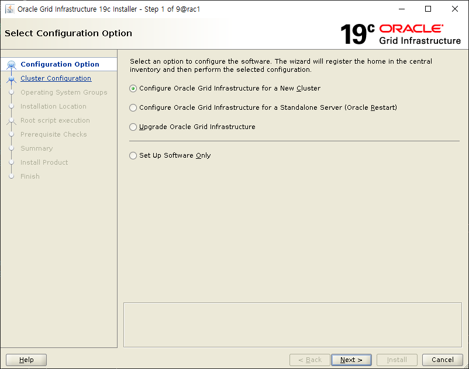
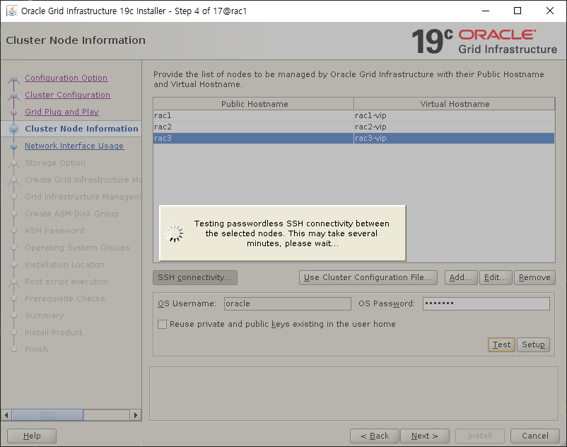
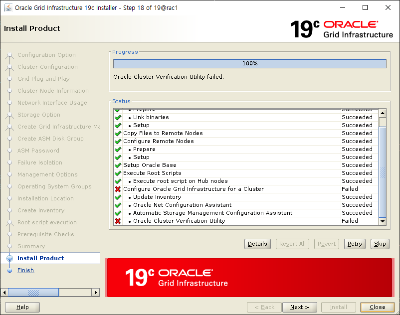
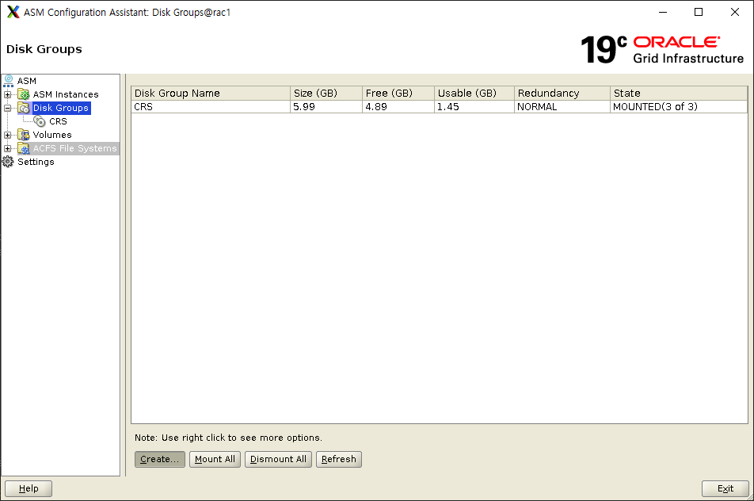
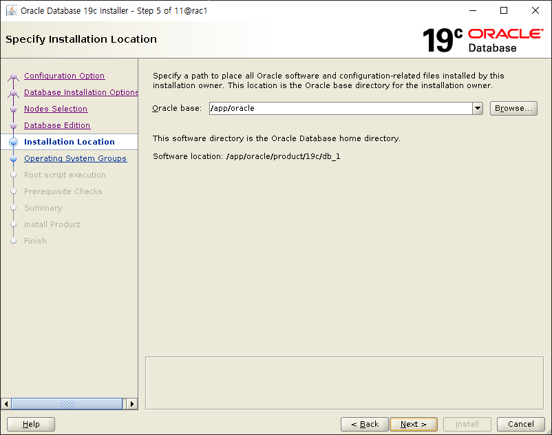

아래 설치에 필요한 파일들은 현 폴더 안의 OracleLinux8_19cASMRAC_Install_Files에 모두 저장되어 있다.

# Oracle Linux 8 19c ASM RAC Installation

3Node 설치 예정이다.

## Oracle Linux 8 Setting

### Oracle Linux 8 Install

먼저 이미지 파일을 다운 받아 Oracle Linux를 설치한다.


### 요약


### VM 설정

#### app mount

먼저 app이라는 디렉터리 하위에 제품들을 설치할 예정이다.
용량을 유동적으로 관리하기 위해 디스크를 LVM으로 생성할 예정이다.

```bash
fdisk -l

fdisk /dev/sdb
# n (enter) (enter) (enter) t 8e w

pvcreate /dev/sdb1

vgcreate pg_app01 /dev/sdb1

lvcreate --extents 100%FREE --name lg_app01 pg_app01

mkfs.ext4 /dev/pg_app01/lg_app01

mkdir /app

mount /dev/mapper/pg_app01-lg_app01 /app

chmod 777 /app

vi /etc/fstab
#/dev/mapper/pg_app01-lg_app01           /app    ext4    defaults        0 0
```

#### hostname setting

hostname을 rac1으로 설정한다.

```bash
hostnamectl set-hostname rac1
```

#### 필요없는 서비스 정리

```bash
systemctl stop firewalld
systemctl disable firewalld
systemctl stop bluetooth
systemctl disable bluetooth
systemctl stop chronyd
systemctl disable chronyd
mv /etc/chrony.conf /etc/chrony.conf.bak
systemctl stop ntpdate
systemctl disable ntpdate
systemctl stop avahi-daemon.socket
systemctl disable avahi-daemon.socket
systemctl stop avahi-daemon
systemctl disable avahi-daemon
systemctl stop libvirtd
systemctl disable libvirtd
```

#### selinux setting

```bash
vi /etc/selinux/config
# SELINUX=disabled
```

#### host setting

```bash
vi /etc/hosts
# PUB
172.16.0.105    rac1            rac1
172.16.0.106    rac2            rac2
172.16.0.107    rac3            rac3

# PRIV
192.168.56.101  rac1-priv       rac1-priv
192.168.56.102  rac2-priv       rac2-priv
192.168.56.103  rac3-priv       rac3-priv

# VIP
172.16.0.108    rac1-vip        rac1-vip
172.16.0.109    rac2-vip        rac2-vip
172.16.0.110    rac3-vip        rac3-vip

# SCAN
172.16.0.111    rac-scan        rac-scan
172.16.0.112    rac-scan        rac-scan
172.16.0.113    rac-scan        rac-scan
```

#### dnsmasq & resolv.conf setting

```bash
vi /etc/dnsmasq.conf
# local=/localdomain/

vi /etc/resolv.conf
# nameserver 127.0.0.1

systemctl start dnsmasq

systemctl enable dnsmasq

nslookup rac-scan
#[root@rac1 ~]# nslookup rac-scan
#Server:         127.0.0.1
#Address:        127.0.0.1#53
#
#Name:   rac-scan
#Address: 172.16.0.112
#Name:   rac-scan
#Address: 172.16.0.111
#Name:   rac-scan
#Address: 172.16.0.113
```

#### 필수 패키지 설치

```bash
yum install -y bc
yum install -y binutils
yum install -y compat-libcap1
yum install -y compat-libstdc++-33
yum install -y elfutils-libelf
yum install -y elfutils-libelf-devel
yum install -y fontconfig-devel
yum install -y glibc
yum install -y glibc-devel
yum install -y kmod-20
yum install -y kmod-libs-20
yum install -y ksh
yum install -y libaio
yum install -y libaio-devel
yum install -y libgcc
yum install -y libstdc++
yum install -y libstdc++-devel
yum install -y libX11
yum install -y libXau
yum install -y libxcb
yum install -y libXi
yum install -y libXtst
yum install -y libXrender
yum install -y libXrender-devel
yum install -y make
yum install -y net-tools
yum install -y nfs-utils
yum install -y policycoreutils
yum install -y policycoreutils-python
yum install -y smartmontools
yum install -y sysstat
yum install -y oracleasm
```

#### 오라클 추가 패키지 설치

```
yum install -y oracle-database-preinstall-19c.x86_64

rpm -Uvh oracleasm-support*

rpm -Uvh oracleasmlib*
```

#### 사용자 설정

```
usermod -g oinstall -G dba,oper,backupdba,dgdba,kmdba,racdba oracle

passwd oracle
```

#### 오라클 유저 설정

```bash
su - oracle

vi ~/.bash_profile
export TMP=/tmp
export TMPDIR=$TMP
export EDITOR=vi
export ORACLE_HOSTNAME=rac1
export ORACLE_UNQNAME=racdb
export DB_UNIQUE_NAME=racdb
export ORACLE_BASE=/app/oracle
export GRID_HOME=/app/grid
export DB_HOME=$ORACLE_BASE/product/19c/db_1
export ORACLE_HOME=$DB_HOME
export ORACLE_SID=racdb1
export ORACLE_TERM=xterm
export BASE_PATH=/usr/sbin:$PATH
export PATH=$ORACLE_HOME/bin:$ORACLE_HOME/OPatch:$GRID_HOME/bin:$BASE_PATH
export LD_LIBRARY_PATH=$ORACLE_HOME/lib:/lib:/usr/lib
export CLASSPATH=$ORACLE_HOME/JRE:$ORACLE_HOME/jlib:$ORACLE_HOME/rdbms/jlib
export NLS_LANG=AMERICAN_AMERICA.AL32UTF8
PS1='[$ORACLE_SID:$PWD]> '

vi ~/.bashrc
alias grid_env='export ORACLE_HOME=$GRID_HOME;export ORACLE_SID=+ASM1;export ORACLE_HOME=$GRID_HOME;export PATH=$ORACLE_HOME/bin:$ORACLE_HOME/OPatch:$GRID_HOME/bin:$BASE_PATH'
alias db_env='export ORACLE_HOME=$DB_HOME;export ORACLE_SID=racdb1;export ORACLE_HOME=$DB_HOME;export PATH=$ORACLE_HOME/bin:$ORACLE_HOME/OPatch:$GRID_HOME/bin:$BASE_PATH'
```

#### root 유저 설정

```bash
su - root

vi ~/.bash_profile
export ORACLE_BASE=/app/oracle
export GRID_HOME=/app/grid
export DB_HOME=$ORACLE_BASE/product/19c/db_1
export PATH=$PATH:$GRID_HOME/bin
```

### 공유 스토리지 구성

| File      | Capacity | Memo               |
| --------- | -------- | ------------------ |
| CRS1.vdi  | 2GB      | CRS 저장 영역      |
| CRS2.vdi  | 2GB      | CRS 저장 영역      |
| CRS3.vdi  | 2GB      | CRS 저장 영역      |
| DATA1.vdi | 200GB    | DATA 저장 영역     |
| DATA2.vdi | 200GB    | DATA 저장 영역     |
| FRA1.vdi  | 300GB    | Fast Recovery Area |
| AFCS1.vdi | 300GB    | AFSC 영역          |

```bash
su - root

oracleasm configure -i
# oracle oinstall y y

oracleasm init

oracleasm status

oracleasm configure

fdisk /dev/sd[c, d, e, f, g, h, i]
# n (enter) (enter) (enter) (enter) w

oracleasm createdisk CRS1 /dev/sdc1
oracleasm createdisk CRS2 /dev/sdd1
oracleasm createdisk CRS3 /dev/sde1
oracleasm createdisk DATA1 /dev/sdf1
oracleasm createdisk DATA2 /dev/sdg1
oracleasm createdisk FRA1 /dev/sdh1
oracleasm createdisk ACFS1 /dev/sdi1

oracleasm scandisks
oracleasm listdisks
```

### 타 노드 생성

#### 공유 스토리지 제거


#### 복제 후 공유 스토리지 연결


#### 타 노드 설정

```bash
su - root

hostnamectl set-hostname rac[2, 3]

vi ~oracle/.bash_profile
# export ORACLE_HOSTNAME=rac[2, 3]
# export ORACLE_SID=racdb[2, 3]

vi ~oracle/.bashrc
#alias grid_env='export ORACLE_HOME=$GRID_HOME;export ORACLE_SID=+ASM[2, 3];export ORACLE_HOME=$GRID_HOME;export PATH=$ORACLE_HOME/bin:$ORACLE_HOME/OPatch:$GRID_HOME/bin:$BASE_PATH'
#alias db_env='export ORACLE_HOME=$DB_HOME;export ORACLE_SID=racdb[2, 3];export ORACLE_HOME=$DB_HOME;export PATH=$ORACLE_HOME/bin:$ORACLE_HOME/OPatch:$GRID_HOME/bin:$BASE_PATH'
```

## Oracle 19c RAC Grid Infrastructure(GI) Installation

### 설치 사전 작업

#### GRID_HOME 경로 생성 및 Grid 설치파일 압축 해제

```bash
su - oracle

grid_env

mkdir -p $GRID_HOME

unzip LINUX.X64_193000_grid_home.zip
```

#### cvuqdisk 패키지 설치

```bash
su root

cd $GRID_HOME/cv/rpm

rpm -Uvh cvuqdisk-1.0.10-1.rpm
```

#### 타 노드에 rpm 전송 후 cvuqdisk 패키지 설치

```bash
su root

cd $GRID_HOME/cv/rpm

scp cvuqdisk-1.0.10-1.rpm rac2:/tmp
# yes

scp cvuqdisk-1.0.10-1.rpm rac3:/tmp
# yes

ssh root@rac2

rpm -Uvh /tmp/cvuqdisk-1.0.10-1.rpm

ssh root@rac3

rpm -Uvh /tmp/cvuqdisk-1.0.10-1.rpm
```

#### OPatch 파일 최신 파일로 교체

```bash
su - oracle

grid_env

cd $GRID_HOME

mv OPatch OPatchold

unzip p6880880_190000_Linux-x86-64.zip

$GRID_HOME/OPatch/opatch version -oh $GRID_HOME
```

#### ssh 설정

```bash
su - oracle

grid_env

cd $GRID_HOME/oui/prov/resources/scripts
./sshUserSetup.sh -user oracle -hosts "rac1 rac2 rac3" -noPromptPassphrase -advanced
# yes
```

#### 클러스터 구성 환경 사전 검증(OL8에서는 동작하지 않음)

```bash
su - oracle

grid_env

cd $GRID_HOME

./runcluvfy.sh stage -pre crsinst -n rac1,rac2,rac3 -osdba dba -orainv oinstall -fixup -method root -networks enp0s3/enp0s8 -verbose
```

#### 패치 파일 압축 해제

```bash
su - oracle

grid_env

cd /app/media

unzip p32900083_190000_Linux-x86-64.zip
```

### GI 패치 및 설치

```bash
su - oracle

grid_env

cd $GRID_HOME

./gridSetup.sh -applyRU /app/media/32900083/32895426
```











### 설치 후 점검

```bash
crsctl stat res -t

ocrcheck
```

## ASMCA

### ASMCA 진행

```bash
asmca
```





## DB Installation

### DB 소프트웨어 설치

```bash
db_env

cd $ORACLE_HOME

unzip LINUX.X64_193000_db_home.zip

mv OPatch OPatchold

unzip p6880880_190000_Linux-x86-64.zip

$ORACLE_HOME/OPatch/opatch version -oh $ORACLE_HOME

./runInstaller -applyRU /app/media/32900083/32895426/
```





### 모든 노드 OJVM 패치

```bash
cd /app/media/32900083/32876380

$ORACLE_HOME/OPatch/opatch apply -oh $ORACLE_HOME
# y y

$ORACLE_HOME/OPatch/opatch lspatches -oh $ORACLE_HOME

chmod 6751 /app/oracle
```

### DB 생성

```bash
su - oracle

db_env

dbca
```


