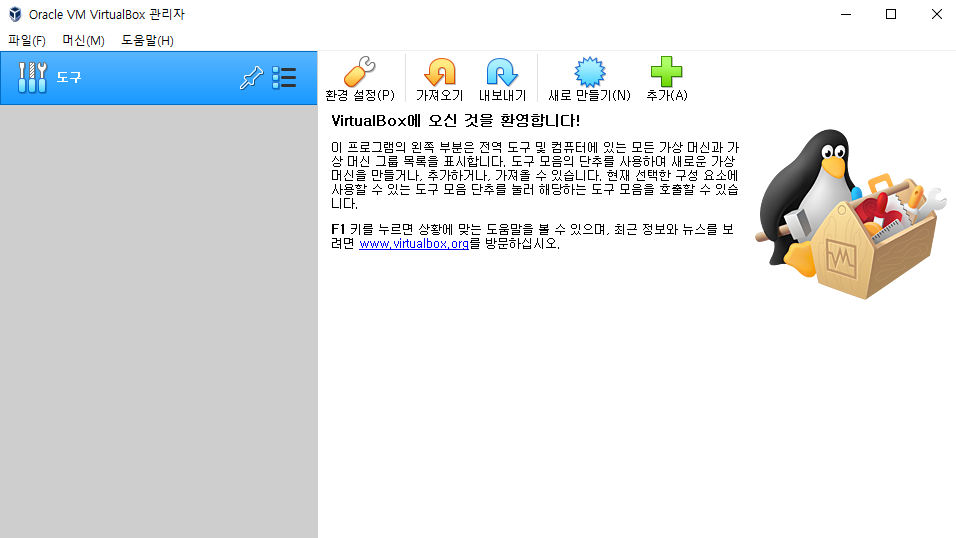

# OJT

## 목차

-   **[Unix / Linux 구조 및 파일 시스템](#Unix--Linux-구조-및-파일-시스템)**
    -   [OS](#OS)
    -   [Virtual Machine](#Virtual-Machine)
    -   [VIM](#VIM)
    -   [Shell Script](#Shell-Script)
-   **[Oracle](#Oracle)**
    -   [RDBMS의 특징](#RDBMS의-특징)
    -   [Oracle Standalone 설치](#Oracle-Standalone-설치)
    -   [Oracle Admin](#Oracle-Admin)
    -   [Oracle Architecture](#Oracle-Architecture)
    -   [Backup & Recovery](#Backup--Recovery)
    -   [ASM](#ASM)
    -   [RAC](#RAC)
    -   [Multitenant](#Multitenant)
-   **[Other Database](#Other-Database)**
    -   [MySQL / MariaDB](#MySQL--MariaDB)
    -   [PostgreSQL](#PostgreSQL)
    -   [Tibero](#Tibero)
-   **[Ark Product](#Ark-Product)**
    -   [Ark for FR](#Ark-for-FR)
    -   [Ark for Oracle](#Ark-for-Oracle)
    -   [Ark for CDC](#Ark-for-CDC)

# Unix / Linux 구조 및 파일 시스템

## OS

OS란 Operating System의 줄임말이다.
OS는 한국어로 운영체제라고 한다.

### 개요

운영체제를 정리하면 하드웨어와 시스템 리소스를 제어하고 프로그램에 대한 일반적 서비스를 지원하는 시스템 소프트웨어이다.
시스템 하드웨어를 관리할 뿐 아니라 응용 스포트웨어를 실행하기 위해 하드웨어 추상화 플랫폼과 공통 시스템 서비스를 제공한다.

운영체제는 입출력과 메모리 할당 같은 하드웨어 기능의 경우 응용 프로그램과 컴퓨터 하드웨어 사이의 중재 역할을 한다.
응용 프로그램 코드는 일반적으로 하드웨어에서 직접 실행된다.

운영체제는 실행되는 응용 프로그램들이 메모리와 CPU, 입출력 장치 등의 자원을 사용할 수 있도록 만들어 준다.
위 자원들을 추상화하여 파일 시스템 등의 서비스를 제공한다.
멀티태스킹을 지원하는 경우 여러 개의 응용 프로그램을 실행하고 있는 동안 운영체제는 모든 프로세스들을 스케줄링하여 동시에 수행되는 것 처럼 보여주는 효과를 한다.

운영체제는 대표적으로 네 가지 역할을 수행한다.

| 역할            | 설명                                                         |
| --------------- | ------------------------------------------------------------ |
| 자원 관리       | 컴퓨터의 한정적인 자원을 효율적으로 관리한다.                |
| 보안            | 소프트웨어나 외부 사용자가 데이터를 삭제하거나, 중요한 파일에 접근하는 것을 막거나, Read Only로 보호한다. |
| 인터페이스 제공 | GUI, CLI 등 사용자가 편리하게 커널의 자원을 사용할 수 있도록 한다. |
| 프로세스 관리   | 컴퓨터가 여러 작업을 동시에 효율적으로 처리할 수 있게 한다.  |

### 종류

#### 싱글태스킹 / 멀티태스킹

-   싱글태스킹 운영체제
    -   한번에 오직 하나의 프로그램만 실행할 수 있다.
-   멀티태스킹 운영체제
    -   시분할을 통해 하나 이상의 프로그램이 동시에 실행할 수 있다.
    -   선점형과 비선점형(협동형)이 있다.
        -   선점형 멀티태스킹의 경우 CPU 시간을 쪼개 프로그램들 각각에 슬롯을 할당한다.
            -   Solaris, Linux 등의 Unix 계열 운영체제
        -   비선점형 멀티태스킹의 경우 정해진 방식에 따라 다른 프로세스들에 시간을 제공하기 위해 각 프로세스에 의존한다.
            -   16bit 버전의 Microsoft Windows

#### 단일 사용자 / 다중 사용자

-   단일 사용자 운영체제
    -   사용자 구별이 없으나 여러 프로그램이 나란히 실행하는 것은 가능하다.
-   다중 사용자 운영체제
    -   디스크 공간과 같은 리소스와 프로세스를 식별하는 기능을 갖춘 멀티태스킹의 기본개념을 확장한 것이다.
    -   여러 사용자에 속해 있으며 여러 사용자가 동시에 시스템과 상호 작용할 수 있게 한다.
    -   시분할 운영체제들은 시스템의 효율적인 이용을 위해 태스크를 스케줄링한다.

#### 분산 운영체제

-   구별된 컴퓨터 그룹을 관리해 하나의 컴퓨터인 것처럼 보이게 만든다.
-   서로 통신하는 네트워크화된 컴퓨터들이 개발되며 분산 컴퓨팅이 활성화되었다.
-   분산되는 연산들은 하나 이상의 컴퓨터에서 수행된다.
-   하나의 그룹에 속하는 컴퓨터들이 협업할 때 분산 시스템을 형성한다.

#### 판형 운영체제

-   배포 형식이나 클라우드 컴퓨팅 환경에서 하나의 가상 머신 이미지를 게스트 운영체제로 만드는 것을 가리킨다.
-   실행 중인 여러 개의 가상 머신을 위한 도구로 이를 저장한다.
    -   가상화와 클라우드 컴퓨팅 관리 둘 다에 사용된다.
        -   대형 서버 웨어하우스 환경에서 흔히 볼 수 있다.

#### 임베디드 운영체제

-   임베디드 컴퓨터 시스템에서 사용할 수 있게 설계된 운영체제이다.
    -   임베디드 컴퓨터 시스템: 내장형 시스템, 기계나 기타 제어가 필요한 시스템에 대해 제어를 위한 특정 기능을 수행하는 컴퓨터 시스템
-   조그마한 기계에 동작하도록 설계되어 있다.
-   제한된 수와 자원으로 동작한다.
    -   매우 크기가 작고 효율적으로 설계되어 있다.

#### 실시간 운영체제

-   특정한 짧은 시간 내 이벤트나 데이터의 처리를 보증하는 운영체제이다.
-   실시간 운영체제는 싱글태스킹일 수도 있고, 멀티태스킹일 수도 있다.

#### 라이브러리 운영체제

-   네트워크 등 일반적인 운영체제가 제공하는 서비스들이 라이브러리 형태로 제공되는 운영체제를 의미한다.

### Unix / Linux

#### Unix

-   AT&T 벨 연구소에서 1970년대 C와 함께 탄생했다.
-   교육, 연구 기관에서 주로 사용하는 다중 사용자, 대화식, 시분할처리 시스템용 운영체제이다.
-   많은 OS의 본보기가 되었다.
-   하드웨어와 같이 배포되는게 일반화되었다.
    -   지원되는 하드웨어와의 높은 호환성과 신뢰성을 기대할 수 있다.

##### 배포판 요약

-   Minix
    -   교육용으로 개발된 Unix, Linux에 영감을 주었다.
-   MacOS
    -   최초 GUI 환경인 Mac Classic의 후속작이며 개인 컴퓨터 시장에서 Unix 중 가장 점유율이 높다.
-   BSD
    -   캘리포니아 대학의 CSRG에서 개발한 범용 OS, 과거에는 Linux 보다 높은 안정성으로 인기가 있었다.
-   AIX
    -   IBM사의 Power 제품군에 올라가는 OS로 주로 대기업과 금융권 등의 대형 서버로 이용된다.
    -   System-V 계열 Unix 중 유일하게 지속적으로 개발 중이다.
-   HP-UX
    -   HP 사에서 개발한 HP Server용 OS이며 2021년부터 업데이트를 하지 않는다.

#### Linux

-   Linux Is Not UniX로 재귀약자로 설명하기도 한다.

##### 기술적인 특징

| 특징                 | 설명                                                         |
| -------------------- | ------------------------------------------------------------ |
| 계층적인 파일 구조   | /를 기준으로 그 하위 디렉터리에 다시 디렉터리가 존재하는 구조이다.<br />이런 구조를 계층적 파일 구조라 한다.(Tree 구조) |
| 장치의 파일화        | Device를 파일화하여 사용한다.<br />특정 하드웨어에 명령을 수행하려면 해당 장치 파일에 명령을 내리는 형식이다. |
| 가상 메모리 사용     | Virtual Memory는 Hard Disk의 일부를 메모리처럼 사용하는 것을 말한다.<br />이런 영역을 SWAP이라고 부른다. |
| 동적 라이브러리 지원 | 프로그램에서 특정 기능을 실행하기 위한 명령어인 Routine들을 모아 놓은 것을 Library라 한다.<br />프로그램 개발 시 Library 중 필요한 Routine들을 받아 Link 시킨다.<br />이런 Routine들을 공유하는 것을 Shared Library라 한다.<br />Dynamic Shared Library는 실행 파일 내부에 넣지 않고 프로그램을 실행할 때 가져다 사용하므로 메모리 효율성이 높다. |
| 가상 콘솔            | Virtual Console은 말 그래도 가상 콘솔을 제공하는 기능이다.<br />리눅스는 기본적으로 6개의 가상 콘솔을 제공한다.<br />`ctrl` + `alt` + `F1` ~ `f6` |
| 파이프               | Pipe는 Process의 통신을 위해 도입된 것이다.<br />어떤 Process의 표준 출력이 다른 프로세스의 표준 입력으로 쓰는 것을 말한다.<br />`|` |
| Redirection          | Process의 I/O를 Standard I/O가 아닌 다른 I/O로 변경할 때 사용한다.<br />출력 결과를 파일로 저장하거나 파일의 내용을 Process의 입력으로 사용하는 기법이다. |

##### 배포판 요약

-   Redhat 계열
    -   Redhat Linux와 커뮤니티 버전인 Fedora에서 파생된 배포판들이다.
    -   패키지 형식은 .rpm이며 패키지 관리자로 yum을 사용한다.
    -   CentOS, Oracle Linux 등이 있다.
-   Debian 계열
    -   데비안에서 파생된 배포판들이다.
    -   패키지 형식은 .deb이며 패키지 관리자로 apt를 사용한다.
    -   Chrome OS, TmaxOS 등이 있다. 
-   Ubuntu 계열
    -   Kubuntu, Vanilla OS 등이 있다.
-   Arch 계열
    -   아치 리눅스에서 파생된 배포판들이다.
    -   패키지 관리자는 pacman이며 형식은 특정 확장자 없이 tar.gz나 tar.xz이나 관례적으로 압축용 확장자 앞에 .pkg가 붙는다.
    -   Steam OS 등이 있다.
-   SUSE 계열
    -   슬랙웨어 기반으로 시작했으나 현재는 관계가 멀어지고 .rpm을 사용하여 독자적 계열로 취급한다.
    -   openSUSE 등이 있다.

#### 기본 구조 및 구성

#### 

Hardware <-> Kernel <-> Shell <-> Application <-> User

| 구조        | 설명                                                         |
| ----------- | ------------------------------------------------------------ |
| Hardware    | 컴퓨터의 하드웨어이다.<br />CPU, 모니터, 키보드, RAM, GPU, Sound Card, 메인보드와 같은 물리적 부품을 의미한다. |
| Kernel      | OS의 다른 부분이나 Application 수행에 필요한 여러 서비스를 제공한다.<br />프로그램 실행 과정에서 가장 핵심적인 연산이 이루어지는 부분이다.<br />Core라고도 부른다.<br />Hardware를 직접 제어하고, Process 관리, Memory 관리, File System 관리 등을 수행하는 OS의 핵심이다.<br />Application과 Hardware 사이의 관리자 역할을 수행하며 Shell과 연관되어 실행하는 명령을 수행하고 수행 결과를 Shell로 보내는 역할을 한다. |
| Shell       | OS 상 다양한 OS 기능과 서비스를 구현하는 Interface를 제공한다.<br />사용자의 명령을 해석해 Kernel로 전달하는 프로그램이다.<br />OS의 내부를 감싸는 층이여서 Shell이라고 부른다. |
| Application | OS에서 실행되는 모든 Software                                |

#### Group / User

리눅스는 다중 사용자 운영체제이다.
사용자는 별도의 권한을 가지고 있으며 권한에 따라 파일을 읽고 쓰고 실행할 수 있다.

유저를 확인하는 방법은 `/etc/passwd`를 조회하면 된다.

```bash
cat /etc/passwd

root:x:0:0:root:/root:/bin/bash
...
ark:x:1000:1000:ark:/home/ark:/bin/bash
...
```

`/etc/passwd` 파일의 뜻은 다음과 같다.

```bash
root	:x			:0	:0	:root		:/root			:/bin/bash
Username:Password	:UID:GID:Description:Home Directory	:Shell Information
```

위 Password의 x는 비밀번호가 보안되어있다는 뜻이다.

리눅스에는 Group이라는 개념이 있다.
어떤 파일이나 디렉터리를 특정 권한의 사용자들만 사용할 수 있게 하는 데에 사용한다.

그룹을 확인하는 방법은 `/etc/group`을 조회하면 된다.

```bash
cat /etc/group

root:x:0:
...
ark:x:1000:
...
```

`/etc/group` 파일의 뜻은 다음과 같다.

```bash
root		:x			:0	:
Groupname	:Password	:GID:Group Users
```

기본적으로 Group의 경우 그냥 생성했을 때 1000번 부터 생성되는 것을 확인할 수 있다.

따로 옵션을 주어 해당하는 그룹을 만들 수도 있다.

```bash
groupadd -g 54321 oinstall
```

생성한 그룹은 사용자에게 부여할 수 있다.

```bash
usermod -G oinstall ark

id ark

uid=1000(ark) gid=1000(ark) groups=1000(ark),54321(oinstall)
```

##### 권한

Linux는 하나의 컴퓨터를 여러 사람이 사용할 수 있는 Multi User OS기에 권한 관리가 중요하다.
파일이나 디렉터리의 소유권을 변경하거나 권한을 변경할 수 있다.

파일이나 디렉터리의 소유권과 권한을 확인하는 방법은 `ls -l`을 통해 확인할 수 있다.

```bash
ls -l

-rw------- 1 oracle dba 115983 Nov  3 12:36 nohup.out
```

첫 10자리는 파일의 종류와 권한들, 이어서 링크 개수, 소유자, 소유 그룹, 용량, 최종 편집 일자, 파일명이다.
첫 10자리 중 2~10번째가 권한에 관한 값이고 소유자와 소유 그룹이 소유권과 관련된 값이다.

파일이나 디렉터리의 소유권을 바꾸는 명령어는 `chown`이다.

```bash
chown root:root nohup.out		# <user>:<group> 쌍으로 변경, <user>.<group>으로 대치 가능
chown root:root -R /directory	# 하위 경로의 소유권을 모두 변경
```

파일이나 디렉터리의 권한은 Read, Write, eXecute로 표시한다.
단어 그대로 r은 읽기, w는 쓰기, x는 실행하는 권한을 말한다.
권한은 소유자 User, 그룹 Group, 나머지 Other, 모두 All의 앞자를 따 부여 가능하다.

해당 권한을 2진수로 나열하여 권한을 변경할 수 있다.
권한 변경 명령어는 `chmod`이다.

```bash
chmod u=rwx nohub.out
chmod 700 nohub.out
chmod -R 700 /directory			# 하위 경로의 권한을 모두 변경
```

#### File System

다양한 UNIX 계열 운영체제가 등장하며 운영체제 간 호환성과 이식성을 높이기 위해 POSIX(Portable Operating System Interface in uniX)가 탄생했다.
POSIX는 운영체제 자체가 아닌 응용 프로그램과 운영체제 간 인터페이스를 정의하는 개념이다.
Linux는 POSIX 표준을 만족한다.

파일시스템에는 Ext, Ext2, Ext3, Ext4, XFS 등이 있다.

## Virtual Machine

### Linux 설치

1. 홈페이지([https://virtualbox.org/](https://virtualbox.org/)) 접속한다.
2. VirtualBox를 다운로드한다.
    1. 좌측 Downloads 클릭
    2. OS에 맞게 선택(Windows → Windows hosts)
    3. 다운로드 진행
3. 설치 파일 실행 및 진행
    1. `Next` → `Next` → `Yes` → `Install` → `Yes` → `Finish`
4. 정상 설치 시 화면



5.   Centos iso 파일 다운로드
     1. Centos 다운로드 페이지([https://www.centos.org/download/](https://www.centos.org/download/)) 접속
     2. 원하는 버전의 mirrors 클릭해 원하는 iso 파일 다운로드
6.   새로 만들기를 눌러 가상머신 생성
     1. 가상머신 운영 체제 설정시 종류와 버전을 Linux / Red Hat(64-bit)로 설정
         (이름을 CentOS 7로 설정 시 자동 설정)
     2. 가상머신 메모리 크기 설정(4096MB)
     3. 하드 디스크 설정(새 가상 하드 디스크 만들기)
     4. 디스크 파일 종류 설정(VDI)
     5. 물리적 하드 드라이브 저장 방식 설정(동적 할당)
     6. 위치 및 크기 설정(60GB)
7.   설정 버튼을 눌러 생성을 위한 설정 진행
     1. 저장소 → 컨트롤러 : IDE → 비어 있음 → Choose a disk file… →  CentOS iso 파일
     2. 네트워크 → 어댑터 1,2 → 네트워크 어댑터 사용하기 → NAT / 호스트 전용 어댑터 → 무작위 모드 모두 허용
8.   Install CentOS 7 → 하단 이미지와 같이 소프트웨어 선택


9.   이더넷(enp0s3) 켜기
10.   root와 사용자 생성 → 설치 완료 → 재부팅
11.   라이센스 동의 → 설정 완료 → 끝

### 리눅스 주요 명령어

- `ls`

    List Segments: 현재 위치의 파일 목록을 조회한다.

    | -l   | 파일의 상세정보                                              |
    | ---- | ------------------------------------------------------------ |
    | -a   | 숨김 파일 표시                                               |
    | -t   | 파일들을 생성시간 역순으로 표시                              |
    | -rt  | 파일들을 생성시간순으로 표시                                 |
    | -f   | 파일 표시 시 마지막 유형에 나타내는 파일명을 끝에 표시(/: 디렉터리, *: 실행파일, @: 링크 등) |

- `cd`

    Change Directory: 디렉터리를 이동한다.

    | [route] | 기입한 루트의 디렉터리로 이동 |
    | ------- | ----------------------------- |
    | ~       | 홈 디렉터리로 이동            |
    | /       | 최상위 디렉터리로 이동        |
    | .       | 현재 디렉터리                 |
    | ..      | 상위 디렉터리로 이동          |
    | -       | 이전 경로로 이동              |

- `touch`

    0 byte 파일 생성, 파일의 날짜, 시간을 수정한다.

    | [file]                   | file을 생성                                   |
    | ------------------------ | --------------------------------------------- |
    | -c [file]                | file의 시간을 현재시간으로 갱신               |
    | -t [YYYYMMDDhhmm] [file] | file의 시간을 YYYYMMDDhhmm으로 갱신           |
    | -r [oldfile] [newfile]   | newfile의 날짜 정보를 oldfile과 동일하게 변경 |

- `mkdir`

    MaKe DIRtory: 디렉터리 생성

    | [dir]                 | dir인 디렉터리 생성                         |
    | --------------------- | ------------------------------------------- |
    | [dir1] [dir2]         | dir1, dir2 디렉터리 생성                    |
    | -p [dir1]/[dir2]      | dir1 디렉터리 생성, dir2 하위 디렉터리 생성 |
    | -m [Permission] [dir] | Permission을 갖는 dir인 디렉터리 생성       |

    - Permission

        2진수 기준 자리 수가 1일 때 권한이 있다.

        1의 자리 → 실행

        2의 자리 → 쓰기

        4의 자리 → 읽기

        Permission은 8진수 기준 3자리이다.

        1의 자리 → 일반 사용자

        8의 자리 → 소유 그룹

        64의 자리 → 소유자

- `cp`

    CoPy: 파일을 복사한다

    | [file1] [file2]    | file1을 file2라는 이름으로 복사                  |
    | ------------------ | ------------------------------------------------ |
    | -f [file1] [file2] | 강제 복사(file2가 존재 시 대치)                  |
    | -r [dir1] [dir2]   | 디렉터리 복사(폴더 안 모든 하위 경로, 파일 복사) |

- `mv`

    MoVe: 파일을 이동한다.

    | [file1] [file2]        | file1을 file2로 변경      |
    | ---------------------- | ------------------------- |
    | [file1] /[dir]         | file1을 dir로 이동        |
    | [file1] [file2] /[dir] | file1, file2를 dir로 이동 |
    | /[dir1] /[dir2]        | dir1을 dir2로 이름 변경   |

- `rm`

    ReMove: 파일을 삭제한다.

    | [file]    | file을 삭제                                   |
    | --------- | --------------------------------------------- |
    | -f [file] | file을 강제삭제                               |
    | -r dir    | dir를 삭제(디렉터리는 -r 옵션 없이 삭제 불가) |

- `cat`

    CATenate: 파일의 내용을 화면에 출력
    redirection 기호를 사용하여 새 파일 생성

    | [file]          | file의 내용 출력          |
    | --------------- | ------------------------- |
    | [file1] [file2] | file1과 file2의 내용 출력 |
    | [file1] [file2] | more                      |
    | [file1] [file2] | head                      |
    | [file1] [file2] | tail                      |

    - redirection

        - `>`: 기존에 있는 파일 내용을 지우고 저장한다.
        - `>>`: 기존 파일 내용 뒤에 덧붙여서 저장한다.
        - `<`: 파일의 데이터를 명령에 입력한다.

        ex)

        | cat [file1] [file2] > [file3] | file1, file2의 명령 결과를 합쳐 file3에 저장 |
        | ----------------------------- | -------------------------------------------- |
        | cat [file1] >> [file2]        | file2에 file1의 내용 추가                    |
        | cat < [file]                  | file의 결과 출력                             |
        | cat < [file1] > [file2]       | file1의 출력 결과를 file2에 저장             |

- `alias`

    별칭을 지정할 수 있다.

    ```bash
    alias [nick] = '[command]'
    #nick을 실행하면 command가 실행
    unalias [nick]
    #nick이라는 alias 해제
    ```

    ```bash
    #ex)
    alias lsa = 'ls -a'
    unalias lsa
    ```

- `tail`

    파일의 뒷부분을 보여준다.

    옵션 없이 사용 시 마지막 10줄 보여준다.

    | [file]                | file의 마지막 10줄을 보여줌                                |
    | --------------------- | ---------------------------------------------------------- |
    | -f [file]             | tail을 종료하지 않고 file의 업데이트 내용을 실시간 출력    |
    | -n (라인 수) [file]   | file의 마지막 줄부터 지정한 라인 수 까지 출력              |
    | -c (바이트 수) [file] | file의 마지막부터 지정한 바이트만큼 출력                   |
    | -q [file]             | file의 헤더와 상단의 파일 이름을 출력하지 않고 내용만 출력 |
    | -v [file]             | file의 헤더와 이름먼저 출력한 후 내용 출력                 |

- `grep`

    특정 패턴 찾는 명령어이다.

    | -A [N]         | 특정 문자열부터 N 이후 라인까지 출력                        |
    | -------------- | ----------------------------------------------------------- |
    | -B [N]         | 특정 문자열부터 N 이전 라인까지 출력                        |
    | -C [N]         | -A [N] -B [N]                                               |
    | --color=[when] | 특정 문자열을 특정 색으로 표시([when]: never, always, auto) |
    | -d [action]    | 특정 디렉터리에서 특정 문자열 검색                          |
    | -e [pattern]   | 여러 특정 문자열로 검색                                     |
    | -i             | 특정 문자열을 대소문자 구별 없이 검색                       |
    | -v             | 특정 문자열을 제외한 나머지 행 검색                         |
    | -w             | 다른 문자열이 포함되지 않은 문자열만 검색                   |

### Network

#### 요약

| Type              | VM <> VM | VM > Host | VM < HOST    | VM > LAN | VM < LAN     |
| ----------------- | -------- | --------- | ------------ | -------- | ------------ |
| Not attached      | N        | N         | N            | N        | N            |
| NAT               | N        | Y         | Port Forward | Y        | Port Forward |
| NAT Network       | Y        | Y         | Port Forward | Y        | Port Forward |
| Bridged Adapter   | Y        | Y         | Y            | Y        | Y            |
| Internal Network  | Y        | N         | N            | N        | N            |
| Host-only Network | Y        | Y         | Y            | N        | N            |

#### NAT


Host/Guest 설정이 불필요하여 간단하게 외부 네트워크에 접근 가능하다.
가상 라우터 환경을 조성하여 Host OS에서 포트포워딩하는 구조이다.
각 VM 머신은 가상 IP를 할당해 통신한다.
라우터를 공유하지 않으므로 IP가 중복될 수 있다.

#### NAT Network

#### 

NAT Network는 기존 NAT에서 가상 환경을 공유하는 구조이다.
VirtualBox Host-Only 드라이버가 가상의 공유기 역할을 해 가상머신끼리의 통신이 가능하다.

#### Bridge Adapter

#### 

Bridge Adapter 방식은 Host PC와 동일한 네트워크를 사용한다.
Host와 동일한 대역의 IP를 할당해야 한다.
MAC 제한이 걸린 환경의 경우 IP가 할당되지 않을 수 있다.
OS X와 Linux에서는 무선 네트워크에 대해 사용이 제한될 수 있다.

#### Internal Network

#### 

Internal Network는 Host PC의 영향 없이 가상의 내부망 환경을 만들 때 사용한다,
가상의 스위치를 구성한다.
Host PC, 외부 네트워크 연결이 차단되어 가상머신끼리의 통신만 가능하다.
보안과 테스트 환경 구성에 이점이 있다.

#### Host-Only Network

#### 

Host-Only Network는 Internal Networking과 기능면에서 동일하나 내부망에서 Host PC에 IP를 가상으로 한번 더 할당해 가상머신과 통신 가능하다.
외부 네트워크는 Host PC만 접근 가능하며 가상머신에서는 외부 네트워크가 차단된다.

#### Generic Driver

UDP Tunnel과 VDE(Virtaul Distributed Ethernet) Networking을 지원한다.
잘 사용하지 않는다.

-   UDP Tunnel: 서로 다른 Host에서 실행되는 가상머신을 기존 네트워크 인프라를 사용해 통신 가능하다.
-   VDE: Linux Host의 가상 스위치에 연결 가능.

### SSH

Secure Shell의 약자이다.
원격으로 로그인하여 그 안에 있는 명령들을 실행할 수 있는 프로그램이다.
SSH는 암호화 기법을 사용하기에 안전히 통신할 수 있다.

#### SSH 설치

```bash
yum install -y openssh-server openssh-clients openssh-askpass
```

#### SSH 설정

서버 관련 주 설정 파일은 `/etc/ssh/sshd_config`에 존재한다.

```bash
#       $OpenBSD: sshd_config,v 1.103 2018/04/09 20:41:22 tj Exp $

# This is the sshd server system-wide configuration file.  See
# sshd_config(5) for more information.

# This sshd was compiled with PATH=/usr/local/bin:/usr/bin:/usr/local/sbin:/usr/sbin

# The strategy used for options in the default sshd_config shipped with
# OpenSSH is to specify options with their default value where
# possible, but leave them commented.  Uncommented options override the
# default value.

# If you want to change the port on a SELinux system, you have to tell
# SELinux about this change.
# semanage port -a -t ssh_port_t -p tcp #PORTNUMBER
#
#Port 22
#AddressFamily any
#ListenAddress 0.0.0.0
#ListenAddress ::
...
```

### TCP 통신

TCP는 응용 프로그램이 데이터를 교환할 수 있는 네트워크 대화를 설정하고 유지하는 방법을 정의하는 표준이다.
TCP는 IP Network를 통해 통신하는 Host에 실행하는 애플ㄹ리케이션 간 에 신뢰할 수 있고, 순ㄴ서가 정해졌으며, 오류를 체크하고 전송할 수 있다.

### SCP

Secure CoPy의 약자이다.
SSH Protocol 기반 파일 전송 수단이다.

```bash
scp <OPTION> [ID]@[IP]:[PATH] [FILE]
scp <OPTION> [FILE] [ID]@[IP]:[PATH]
```

### X Window

Unix 계열 운영체제에서 사용되는 윈도 시스템과 X Window GUI 환경을 뜻한다.
X11 Window의 Forwading을 활성화 하여 원격으로 GUI를 활용할 수 있다.

### Disk Mount

Linux에서의 Mount는 하드디스크의 파티션, CD/DVD, USB Memory 등을 사용하기 위해 특정 위치에 연결을 해주는 것을 말한다.
쉽제 요약해 물리적 장치를 특정 위치(디렉터리)에 연결시켜주는 과정이다.

### LVM

Logical Volumn Manager의 약자이다.
여러 디스크들을 하나의 디스크처럼 사용할 수 있게 해준다.

## VI(VIM)

Unix 환경에서 가장 많이 쓰이는 문서 편집기이다.
한 화면을 편집하는 VIsual editor라는 뜻에서 유래했다.

모드는 총 3가지가 있다.

### 명령 모드(Command Mode)

처음 VI를 사용하면 진행중인 모드이다.
방향키나 `h`, `j`, `k`, `l`을 이용해 이동할 수 있다.
입력 모드에서 `esc`를 눌러 명령 모드로 돌아올 수 있다.
명령어 사용이 가능하다.
명령어의 경우 `enter`를 누르지 않아도 실행된다.

| 명령어 | 동작                                                |
| ------ | --------------------------------------------------- |
| i      | 현재 커서 위치에 삽입(입력 모드로 전환)             |
| a      | 현재 커서 바로 다음 위치에 삽입(입력 모드로 전환)   |
| o      | 현재 줄 다음 위치에 삽입(입력 모드로 전환)          |
| (N)x   | 커서 위치의 글자 N개 삭제(기입 없으면 1개)          |
| dw     | 커서 위치의 단어 삭제                               |
| (N)dd  | 커서 위치의 N개의 줄 잘라내기(기입 없으면 1개)      |
| u      | 이전 명령 취소                                      |
| (N)yy  | 커서 위치의 N개의 줄을 버퍼로 복사(기입 없으면 1개) |
| p      | 현재 커서가 있는 줄 바로 아래에 버퍼 내용 붙여넣기  |
| k      | 커서가 한 줄 위로 올라감                            |
| j      | 커서가 한줄 아래로 내려감                           |
| l      | 커서가 한칸 우측으로 감                             |
| h      | 커서가 한칸 좌측으로 감                             |
| 0      | 커서가 있는 줄의 맨 앞으로 감                       |
| $      | 커서가 있는 줄의 맨 뒤로 감                         |
| (      | 현재 문장의 처음                                    |
| )      | 현재 문장의 끝                                      |
| {      | 현재 문단의 처음                                    |
| }      | 현재 문단의 끝                                      |
| [N]-   | N개의 줄만큼 위로 이동                              |
| [N]+   | N개의 줄만큼 아래로 이동                            |
| G      | 파일의 끝으로 이동                                  |
| r      | 한 문자 변경                                        |
| cc     | 커서가 있는 줄의 내용 변경                          |

### 입력 모드(Insert Mode)

명령 모드에서 `i`나 `a` 명령을 통해 입력 모드로 넘어갈 수 있다.

### 마지막 행 모드(Last Line Mode)

명령 모드에서 `:`을 입력해 마지막 행 모드로 넘어갈 수 있다.
`enter`를 입력해야 명령이 들어간다.

| 명령어        | 동작                                                         |
| ------------- | ------------------------------------------------------------ |
| w [file name] | 기입한 파일명으로 파일 저장(기입 없을시 현재 파일명으로 저장) |
| q             | vi 종료                                                      |
| q!            | vi 강제 종료                                                 |
| wq            | 저장 후 종료                                                 |
| wq!           | 강제 저장 후 종료                                            |
| f [file name] | 기입한 파일명으로 파일명 변경                                |
| [N]           | N번 줄로 이동                                                |
| $             | 파일의 맨 끝 줄로 이동                                       |
| e!            | 마지막 저장 이후 모든 편집 취소                              |
| /[String]     | 현재 커서 위치부터 앞쪽으로 기입한 문자열 검색               |
| ?[String]     | 현재 커서 위치부터 뒤쪽으로 기입한 문자열 검색               |
| set nu        | vi 라인 번호 출력                                            |
| set nonu      | vi 라인 출력 취소                                            |

## Shell Script

# Oracle

## RDBMS의 특징

## Oracle Standalone 설치

## Oracle Admin

### Startup

### Shutdown

### Oracle 논리적 구조

### 오라클 물리적 구조

### 유저 생성 / 삭제 / 권한 부여 / 권한 강탈

#### 유저 생성

#### 유저 삭제

#### 유저 권한 부여

#### 유저 권한 강탈

### 테이블 생성 / 삭제

#### 테이블 생성

#### 테이블 삭제

### 데이터 조회 / 생성 / 변경 / 삭제

#### 데이터 조회

#### 데이터 생성

#### 데이터 변경

#### 데이터 삭제

### Procedure

#### PL/SQL

#### Procedure 생성

#### Procedure 실행

## Oracle Architecture

### Oracle Server

### Oracle Instance

### Oracle Database

## Backup & Recovery

### Backup

### Recovery

## ASM

## RAC

## Multitenant

# Other Database

## MySQL / MariaDB

## PostgreSQL

## Tibero

# Ark Product

## Ark for FR

## Ark for ORacle

## Ark for CDC