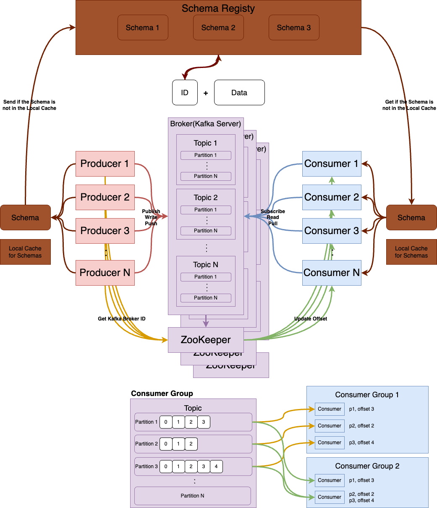
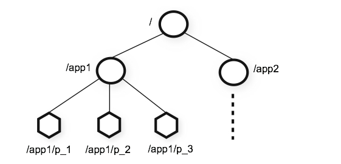
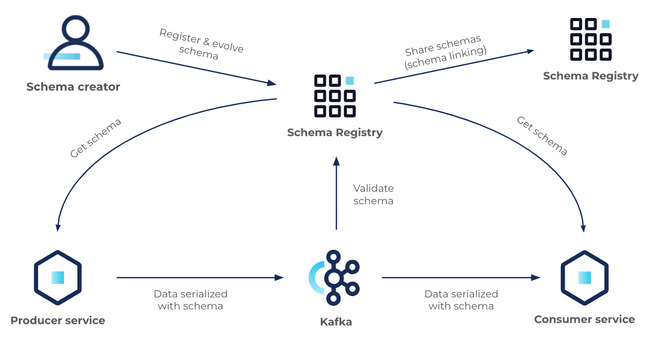

# Kafka 공식 문서

# What is Event Streaming?

Event Streaming은 인체의 중추 신경계와 같은 역할을 하는 Digital Equivalent
Business들이 점차 Software로 정의되고 자동화되며 Software 사용자가 더 많은 Software인 'Always-On(상시 작동)'하는 세상을 위한 Technological Foundation

기술적으로 말해 Event Streaming은 DB, Sensor, Mobile Device, Cloud Service, Software Application과 같은 Event Source에서 Event Streamin의 형태로 Data를 실시간으로 Capture하는 관행
나중에 검색할 수 있도록 이러한 Event Stream을 지속적으로 저장
Real-Time과 회고적으로 Event Stream을 조작, 처리 반응하며 필요에 따라 Event Stream을 다른 Target Technogy들로 Routing
따라서 Event Streaming은 Data의 지속적인 흐름과 해석을 보장해 올바른 정보가 적시에 올바른 위치에 있을 수 있도록 함

# What can I use Event Streaming for?

Event Streaming은 수많은 산업과 조직의 다양한 사용 사례에 적용

- 증권 거래소, 은행, 보험 등에서 실시간으로 결제와 금융 거래를 하기 위해
- 물류와 자동차 산업과 같은 자동차, 트럭, 함대, 선적을 실시간으로 추적하고 모니터링 하기 위해
- 공장과 풍력 단지와 같은 IoT 장치나 기타 장비에서 Sensor Data를 지속적으로 Capture하고 분석하기 위해
- 소매, 호텔, 여행 산업, Mobile Application과 같은 고객 상호 작용과 주문을 수집하고 즉시 반응하기 위해
- 병원 치료 중인 환자를 Monitoring하고 상태 변화를 예측해 응급 상황에서 적시에 치료할 수 있기 위해
- 회사의 여러 부서에서 생성된 Data를 연결, 저장, 사용 가능하게 만들기 위해
- Data Platform, Event-Based Architecture, Microservice의 Foundation 역할을 하기 위해

# Apache Kafka® is an event streaming platform. What does that mean?

Kafka는 세 주요 기능을 결합한 Battle-Test를 거친 단일 Solution으로 종단 간 Event Streaming에 대한 사용 사례를 구현할 수 있음

1. 다른 System에서 Data를 지속적으로 Import/Export를 포함해 Event Stream을 Publish(Write)/Subscribe(Read)
2. 원하는 기간 동안 지속적이고 안정적으로 Event Streaming을 저장
3. Event 발생 시나 회고적으로(과거에 일어난 Event를 되돌아보며) Event Stream을 처리

이 모든 기능은 Distribute(분산)되어 있고 높은 Scalable(확장성), Elastic(탄력성), Fault-Tolerant(내결함성), Secure Manner(안전한 방식)으로 제공
 Kafka는 Bare-Metal Hardware, Virtual Machine, Container, On-Premise, Cloud에서 Deploy 가능
Kafka Environment Self-Managing과 다양한 Vendor에서 제공하는 Fully-Managed Service 중 선택 가능

# How does Kafka work in a Nutshell?

Kafka는 고성능 High-Performance TCP Network Protocol을 통해 통신하는 Server와 Client로 구성된 Distributed System
On-Premise와 Colud Environment들의 Bare-Metal Hardware, VM, Container에서 Deploy 가능

**Servers**: Kafka는 여러 Data Center나 Cloud Region들에 걸쳐 있을 수 있는 하나 이상의 Server Cluster로 실행
이런 Server 중 일부는 Broker라고 하는 Storage Layer를 형성
다른 Server는 Kafka Connect를 실행해 Data를 Event Streaming으로 지속적으로 Import/Export하여 Kafka를 RDB와 기타 Kafka Cluster와 같은 기존 System과 통합
Mission-Critical 사용 사례를 구현할 수 있도록 Kafka Cluster는 Scalable이 뛰어나고 Fault-Tolerant가 있음
Server 중 하나라도 실패하면 다른 Server가 Operation을 인계해 Data 손실 없이 지속적인 운영을 보장

**Clients**: Client를 통해 Networ 문제나 Machine Failure가 발생한 경우에도 대규모로 Fault-Tolerant 방식으로 Event Stream을 병렬로 읽고 쓰고 처리하는 Distributed Application과 Microservice를 작성 가능
Kafka는 Kafka Community에서 제공하는 수십 개의 Client에 의해 보강된 일부 Client와 함께 배송됨
Client는 상위 Level Kafka Streams Library를 포함해 Java, Scala, Go, Python, C/C++ 등의 여러 Programming Language들과 REST API에서 사용할 수 있음

# Main Concepts and Terminology

**Event**는 어떤 일이 일어났다는 것을 기록(Documentation에서는 Record나 Message등으로도 표현)
Kafka에서 Data를 읽거나 쓸 때 Event Form으로 수행
개념적으로 Event에는 Key, Value, Timestamp, Optional Metadata Header가 있음

 예시

**Producer**는 Event를 Kafka에 Publish(Write)하는 Client Application이며 **Consumer**는 Event를 Subscribe(Read & Process)하는 Application
Kafka에서 Producer와 Consumer는 서로 완전히 분리되어 있으며 Kafka의 높은 Scalablity를 달성하기 위한 핵심 설계 요소
예시로 Produver는 Consumer를 기다릴 필요 없음(Kafka는 Event를 정확히 한 번 처리하는 기능과 같은 다양한 보장을 제공)

**Topic**은 Event를 저장
매우 단순화된 Topic은 File System의 Folder(Directory)와 유사하며 Event는 해당 Folder의 File과 같음
Kafka의 Topic은 항상 Multi-Producer이며 Multi-Consumer
Topic에는 Event를 쓰는 0~N개의 많은 Producer와 읽는 0~N개의 Consumer가 있을 수 있음
Topic의 Event는 필요한 만큼 자주 읽을 수 있음
기존 Messaging System과 달리 Event는 Consumption 후에도 삭제되지 않음
대신 Kafka가 Topic 별 Configuration Setting을 통해 Event를 유지해야 하는 기간을 정의하고 정의한 기간 이후에 Event가 삭제됨
Kafka의 성능은 Data Size와 관련해 실질적으로 일정하므로 장기간 Data를 저장해도 괜찮음

Partition은 Topic을 분할한 것, 쉽게 말해 Topic이 다른 Kafka Broker에 있는 여러 Bucket에 분산되어 있음
Data의 이러한 Distributed Placement는 Client Application이 여러 Broker에서 동시에 Data를 Read/Write 할 수 있도록 하기 때문에 Scalability에 매우 중요
새 Event가 Topic에 Publish 되면 실제로 Topic의 Partition 중 하나에 추가
Event Key가 동일한 Event는 동일한 Partition에 기록
Kafka는 주어진 Topic Partition의 모든 Consumer가 해당 Partition의 Event를 작성된 순서와 정확히 동일한 순서로 Read하도록 항상 보장


위 사진에는 P1~P4까지 총 4개의 Partition이 있음
서로 다른 두 Producer Client가 Network를 통해 Topic의 Partition에 Event를 작성해 서로 독립적으로 새 Event를 Topic에 Publish하고 있음
Key가 같은 Event는 동일한 Partition에 기록
두 Producer는 적절한 경우 동일한 Partition에 Write 가능

Data Fault-Tolerant와 Highly-Available을 만들기 위해 모든 Topic을 Replicate 가능
Geo-Region이나 Data Center 전체에 걸쳐 있으므로 문제가 발생하거나 Broker에 대한 유지 관리를 수행하려는 경우를 대비해 Data 복사본을 가지고 있는 여러 Broker들이 항상 존재
일반적인 Production Setting은 Replication Factor가 3(항상 Data 복사본이 3개 있다는 뜻)
이 Replication은 Topic Partition Level에서 수행

# Kafka APIs

Management와 Administration을 위한 Commain Line Tool 이외에도 Kafka에는 Java와 Scala용 5개의 핵심 API가 있음

- Admin API
  - Topic, Broker, 기타 Kafka Object를 관리하고 검사
- Producer API
  - 하나 이상의 Kafka Topic에 Event Stream을 Publish
- Consumer API
  - 하나 이상의 Topic을 Subscribe하고 생성된 Event Stream을 처리
- Kafka Streams API
  - Stream Processing Application들과 Micro Service들을 구현
  - 변환, 집계, JOIN과 같은 Stateful Operation Event Time Based Processing 등을 포함해 Event Stream을 처리하는 상위 수준 기능 제공
  - 하나 이상의 Topic에 대한 출력을 생성하기 위해 하나 이상의 Topic에서 Input을 읽어 Input Stream을 Output Stream으로 효과적으로 변환
- Kafka Connect API
  - Kafka와 통합할 수 있도록 외부 System과 Application에서 Event Stream을 Read/Write하는 재사용 가능한 Data Import/Export Connector를 구축하고 실행
  - Kafka Community에서 바로 사용 가능한 많은 Connector를 제공하기에 일반적으로 자체 Connector를 구현할 필요 없음

# Kafka



Kafka는 파이프라인, 스트리밍 분석, Data 통합과 Mission Critical Application(비즈니스가 성공하기 위해 지속적으로 작동해야 하는 프로그램)을 위해 설계된 고성능 분산 이벤트 스트리밍 플랫폼이다.
Publish-Subscribe 모델의 메세지 큐이며 분산 환경에 특화되어 있다.

# 용어 사전


| Word                    | Description                                                  | Memo                                                         |
| :---------------------- | :----------------------------------------------------------- | :----------------------------------------------------------- |
| Kafka(= Kafka Cluster)  | Apache 프로젝트 어플리케이션으로 여러 대의 브로커를 구성한 클러스터이다. |                                                              |
| Event(=Record, Message) | 프로듀서와 컨슈머가 데이터를 주고 받는 단위이다. 구성 요소는 Key, Value, Header로 나뉘며 양식은 보통 JSON, Avro, Protobuf로 사용한다. |                                                              |
| Topic                   | 이벤트가 쌓이는 곳이다. 프로듀서는 토픽에 이벤트를 게시하고 컨슈머는 토픽을 구독해 이벤트를 가져와 처리한다. 토픽에 저장된 이벤트는 필요에 의해 다시 읽을 수 있다. | Kafka Topic 명의 규칙은 영문자, 마침표(.), 언더바(_), 하이픈(-)만 사용할 수 있음 |
| Broker                  | Kafka 어플리케이션이 설치된 서버나 노드이다.                 |                                                              |
| Partition               | 토픽은 여러 브로커에 분산되어 저장되며 이런 토픽을 파티션이라고 한다. 이벤트가 어떤 파티션에 저장되는 지는 이벤트의 Key에 의해 정한다. 같은 Key를 사용할 경우 같은 파티션에서 처리한다. |                                                              |
| Segment                 | 프로듀서가 전송한 실제 이벤트가 로컬 디스크에 저장되는 파일이다. |                                                              |
| Producer                | Kafka에 이벤트를 게시(Publish)하는 클라이언트 어플리케이션이다. |                                                              |
| Consumer                | Kafka의 토픽을 구독(Subscribe)해 읽은 이벤트를 처리하는 클라이언트 어플리케이션이다. |                                                              |
| Schema Registry         | Kafka 클라이언트 사이에서 이벤트의 스키마를 저장하고 관리하는 웹 어플리케이션이다. |                                                              |
| ZooKeeper               | 분산 시스템을 구성하기 위해 필요한 분산 합의와 데이터 복사 등의 과정을 효율적으로 처리하기 위해 사용되는 분산 조정(Coordination) 시스템이다. |                                                              |

# 주요 개념

## Kafka 브로커

Kafka 클라이언트와 데이터를 주고받기 위해 사용하는 주체이다.
데이터를 분산 저장해 장애가 발생하여도 안전히 사용할 수 있도록 도와주는 어플리케이션이다.

하나의 서버에 한 개의 카프카 브로커 프로세스가 실행한다.
데이터를 안전히 저장하기 위해 3개 이상의(홀수 권장) 브로커 서버를 1개의 클러스터로 묶어 운영한다.

## 프로듀서와 컨슈머 분리

Kafka의 프로듀서, 컨슈머는 별개로 동작한다.
프로듀서는 브로커의 토픽에 이벤트를 게시만 한다.
컨슈머는 브로커의 특정 토픽을 구독해 가져와 처리만 한다.

위 이유로 인해 Kafka는 높은 확장성을 제공한다.
프로듀서나 컨슈머를 필요에 의해 Scale In/Out하기에 용이한 구조이다.

## Push/Pull 모델

Kafka의 컨슈머는 Pull 모델 기반으로 이벤트 처리한다.
브로커가 컨슈머에게 이벤트를 전달하는 것이 아닌 브로커에게 이벤트를 가져와 처리한다.

- 다양한 컨슈머의 처리 형태와 속도를 고려하지 않아도 된다.
  - Push 모델에서는 브로커가 데이터 전송 속도를 제어하기에 다양한 이벤트 스트림의 컨슈머를 다루기 어렵다.
  - Pull 모델은 컨슈머가 처리 가능한 때에 이벤트를 가져와 처리하기 때문에 다양한 컨슈머 운용이 쉽다.
- 불필요한 지연 없이 일괄 처리를 통해 성능 향상
  - Push 모델의 경우 요청을 즉시 보내거나 더 많은 이벤트를 한번에 처리 가능하도록 버퍼링 가능
    이런 경우 컨슈머가 현재 이벤트를 처리할 수 있음에도 대기해야 하며 전송 지연 시간을 최소로 변경할 시 한 번에 하나의 이벤트만 보내므로 비효율적
  - Pull Model의 경우 마지막으로 처리된 Message 이후의 Message를 Consumer가 처리 가능할 때 모두 가져오기에 불필요한 지연 없이 최적의 일괄처리 가능

## Consumed Message 추적

이벤트는 지정된 토픽에 전달되며 여러 파티션으로 나뉠 수 있음
이벤트는 로그에 순차적으로 끝에 추가됨
이벤트의 상대적 위치를 오프셋이라고 함

메세징 시스템은 브로커에서 컨슘된 이벤트에 대한 메타데이터를 유지
이벤트가 컨슈머에게 전달될 시 브로커는 로컬에 기록하거나 컨슈머의 승인을 대기

## 커밋 & 오프셋

컨슈머의 poll()은 이전에 커밋한 오프셋이 존재할 시 해당 오프셋 이후 Event를 읽음
읽은 후 마지막 으포셋을 커밋한다.
커밋한 후 poll() 실행 시 방금 전 Commit한 Offset 이후 Message를 Read한 후 처리하게 된다.

하지만 이와 같은 이벤트 컨슘으로 인해 아래와 같은 문제가 생길 수 있다.

- Consumed Message 기록 시점
  - 브로커가 이벤트를 네트워크를 통해 컨슈머에게 전달할 때 마다 즉시 컨슘된 것으로 기록하면 컨슈머가 이벤트 처리를 실패할 경우 해당 이벤트가 손실된다.
    이로 인해 브로커는 이벤트가 컨슘되었음을 기록하기 위해 컨슈머의 승인을 기다린다.
- 중복 이벤트 전송과 멱등성
  - 컨슘의 승인을 기다릴 때 컨슈머가 이벤트를 성공적으로 처리한 후 승인을 보내기 전 브로커가 실패했다고 판단하고 다시 이벤트를 보내게 될 경우 컨슈머는 같은 이벤트를 두 번 처리한다.
    따라서 컨슈머는 멱등성을 고려해야 한다.(여러 번 처리해도 한 번 처리한 것과 같은 결과를 가져야 함)

## 컨슈머 그룹

컨슈머 그룹은 하나의 토픽을 구독하는 여러 컨슈머들의 모음이다.
토픽을 구독하는 컨슈머들을 그룹화하면 가용성이 증가한다

컨슈머 그룹의 각 컨슈머들은 하나의 토픽을 각기 다른 파티션의 내용만 처리 가능하다.
이를 통해 카프카는 이벤트 처리 순서를 보장한다.
특정 파티션을 처리하거나 컨슈머가 처리 불가 상태가 된다면 해당 파티션의 이벤트를 처리할 수 없는 상태가 되므로 컨슈머 그룹이 필요하다.

### 리밸런스

파티션을 담당하는 컨슈머가 처리 불가 상태가 되면 파티션과 컨슈머를 재 조정해 남은 컨슈머 그룹 내의 컨슈머들이 파티션을 적절히 나누어 처리한다.
컨슈머 그룹 내 컨슈머들 간 오프셋 정보를 공유하기에 특정 컨슈머가 처리 불가 상태가 되었을 때 해당 컨슈머가 처리한 마지막 오프셋 이후부터 처리 가능하다.
컨슈머 그룹이 있어야 위와 같은 리밸런스 가능하다.

### 컨슈머 그룹과 파티션, 컨슈머 확장

컨슈머 그룹 내 컨슈머들은 모두 다른 파티션에 연결된다.(컨슈머의 이벤트 처리 순서 보장) 

컨슈머 성능이 부족해 컨슈머를 확장할 때 컨슈머 그룹 내의 컨슈머들은 무조건 다른 파티션에만 연결 가능하다.
그렇기 때문에 컨슈머가 파티션보다 많을 경우 남는 컨슈머는 동작하지 않는다.
따라서 컨슈머를 늘려줄 때 파티션도 늘려주어야 한다.

## 이벤트 전달 컨셉

- At Most Once
  - 이벤트가 손실 될 수 있으나 재 전달 하지 않는다.
- At Least Once
  - 이벤트가 손실 되지 않으나 재 전달이 발생한다.
- Exactly Once
  - 이벤트가 정확히 한번 전달한다.

# Kafka 메세지

Kafka의 메세지(이벤트, 레코드와 동일)는 전달하는 정보의 단위이다.
Kafka의 메세지는 Key와 Value, Header로 구성된다.

**Kafka 메세지의 Key**는 메세지가 Kafka 브로커 내부에 저장될 때, 저장되는 위치와 관련된 요소이다.
프로듀서가 메세지를 브로커로 전달할 때, 프로듀서의 내부에 파티셔너가 저장 위치를 결정하는데, 이때 키 값을 이용해 연산한 결과로 저장 위치를 결정한다.
Kafka 메세지는 파티션 내에서 오프셋 순서를 보장한다.
Kafka 메세지의 Key 별로 파티션이 나눠져 삽입되기에 Key 당 오프셋을 보장한다.
다양한 타입의 값을 보낼 수 있다.
브로커를 통해 메세지가 발행되거나 소비될 때, 메세지 전체가 직렬화/역직렬화 되기 때문이다.

**Kafka 메세지의 Value**는 메세지가 전달하고자 하는 내용물이다.
단순한 문자열부터 JSON이나 특정 객체가 될 수 있다.
다양한 타입의 값을 보낼 수 있다.
브로커를 통해 메세지가 발행되거나 소비될 때, 메세지 전체가 직렬화/역직렬화 되기 때문이다.

**Kafka 메세지의 Header**는 개별 메세지에 대한 메타데이터나 추가 정보를 제공하기 위해 Kafka 메세지에 첨부할 수 있는 Key-Value 쌍이다.
Apache Kafka 0.11 버전 이후 지원한다.

# Kafka 메세지의 타입

위에서 언급한 것과 같이 Kafka의 Key와 Value는 브로커를 통해 메세지가 발행되거나 소비될 때 메세지 전체가 직렬화/역직렬화하여 다양한 타입으로 전달 가능하다.
이를 설정해주기 위해 key.converter나 value.converter에 원하는 양식을 지정해 사용하면 된다.
주로 JSON, Avro, Protobuf 등을 사용한다.

## JSON

JavaScript Object Notation의 약자로 Attribute-Value 쌍과 배열 데이터 타입, 직렬화 가능한 값, Key-Value 쌍으로 이루어진 데이터 객체를 전달하기 위해 인간이 읽을 수 있는 문자를 사용하는 개방형 표준 포맷이다.
XML의 대용으로 사용하며 XML보다 용량이 가볍고 가독성이 좋다.

## Avro

Apache Hadoop Project에서 개발된 RPC(Remote Procedure Call) 및 데이터 직렬화 프레임워크
데이터 타입과 프로토콜 정의을 위해 JSON을 사용하며 컴팩트 바이너리 양식으로 데이터를 직렬화

### Avro Object Container File

Avro Object Container File은 다음으로 구성된다.

- File Header
  - 4 Byte Obj1
  - File Metadata
  - 16 Byte File을 위한 임시 생성된 동기화 마커
- 하나 이상의 파일 데이터 블록

### Schema Definition

Avro Schema는 JSON을 이용해 정의한다.
null, boolean, int, long, float, bytes, string, record, enum, array, map, union, fixed로 구성된다.

```json
{
    "namespace": "example.avro"
    "type": "record",
    "name": "Example",
    "fields": [
        {
            "name": "String",
            "type": "string"
        },
        {
            "name": "number",
            "type": ["double", "null"]
        },
        {
            "name": "Bool",
            "type": "boolean"
        },
    ]
}
```

## Protocol Buffer(Protobuf)

Google에서 개발한 구조화된 데이터를 직렬화하는 방식 중 하나이다.
구조화된 데이터는 바이너리 양식으로 저장되기 때문에 XML과 JSON 양식보다 크기가 작아 효과적이다.

### Schema Definition

```protobuf
syntax = "proto2";
 
message Point {
    required int32 x = 1;
    required int32 y = 2;
    optional string label = 3;
}
 
message Line {
    required Point start = 1;
    required Point end = 2;
    optional string label = 3;
}
 
message Polyline {
    repeated Point point = 1;
    optional string label = 2;
}
```

# ZooKeeper

Apache ZooKeeper는 동기 서비스와 대용량 분산 시스템을 위한 네이밍 레지스트리를 제공한다.

ZooKeeper 아키텍쳐는 중복 서비스를 이용한 고가용성를 제공한다.
클라이언트는 ZooKeeper Master가 응답하지 않으면 다른 ZooKeeper Master에게 요청한다.
ZooKeeper 노드들은 파일 시스템이나 트리 데이터 구조와 비슷한 구조의 네임스페이스 안에 데이터들 저장한다.
클라이언트들은 이 노드에게서 읽거나 쓴다.

## Architecture

- 노드: 클러스터(앙상블)에 설치된 시스템
- Z노드(ZNode): 클러스터 내 다른 노드들에 의해 상태가 업데이트 된 노드
- 클라이언트 어플리케이션: 분산 어플리케이션들과 통신하는 도구들
- 서버 어플리케이션: 공통 인터페이스를 사용해 클라이언트 어플리케이션들이 통신할 수 있게 허용



- 각 ZNode는 데이터 변경 등에 대한 유효성 검사 등을 위해 버전 번호를 관리한다(데이터가 변동 될 때마다 ZNode의 버전 번호 증가).
- ZooKeeper에 저장되는 데이터는 모두 메모리에 저장되어 처리량이 많고 속도가 빠르다.

ZooKeeper는 더 신뢰성 있는 서비스를 위해 앙상블(클러스터)라는 호스트 세트을 구성할 수 있다.
앙상블로 구성되어 있는 ZooKeeper는 과반수 방식에 따라 살아있는 노드 수가 과반 수 이상 유지되면 지속적으로 서비스 가능하다.

# 스키마 레지스트리

토픽 이벤트 데이터의 스키마를 관리, 금증하고 네트워크를 통해 데이터를 직렬화/역직렬화하기 위한 **중앙 저장소** 제공한다.
Kafka 토픽에 대한 프로듀서와 컨슈머는 스키마를 사용해 스키마 진화에 따라 데이터 정합성과 호환성을 보장할 수 있다.
스키마 레지스트리는 데이터 Governance, 데이터 품질 보장, 기본 준수, 데이터 lineage에 대한 가시성, 감사 기능, 팀 간 협업, 효율적인 어플리케이션 개발 프로토콜이며, 시스템 퍼포먼스의 핵심 구성 요소이다.

이벤트 기반 시스템인 컨플루언트 브로커는 스키마 레지스트리를 사용해 프로듀서와 컨슈머 간 Kafka 토픽 이벤트 데이터와 이벤트를 지능적으로 알맞게 전송한다.



스키마 레지스트리는 데이터 유효성 검사, 호환성 검사, 버전 관리, 진화(스키마 변경) 등 여러 이점 제공한다.
데이터 파이프라인의 개발과 유지 보수를 단순화하고 데이터 호환성 문제, 데이터 부패과 손실을 줄여준다.

스키마 레지스트리를 사용하면 데이터 형식과 버전에 대한 스키마를 정의하고 레지스트리에 등록 가능하다.
등록할 시 스키마를 공유하고 다른 시스템과 어플리케이션에서 재사용 가능하다.
프로듀서가 메세지 브로커를 보낼 때 데이터에 대한 스키마가 메세지 헤더에 포함된다.
스키마 레지스트리는 스키마가 유효하고 토픽에 대한 예상 스키마와 호환되는지 확인한다.

요약하면 스키마 레지스트리란 Kafka 클라이언트 사이에서 이벤트의 스키마를 저장, 관리하는 웹 어플리케이션이다.

## 스키마 레지스트리가 필요한 이유

Kafka는 독립적으로 분할 되어 동작한다.
프로듀서는 어떤 컨슈머가 이벤트를 가져가는 지 모르고 컨슈머는 어떤 프로듀서가 메세지를 보냈는지 모른다.

브로커는 이벤트를 로그 형태로 저장한다.
Append-Only이기에 작성은 가장 끝에서 실행되며 중간 수정이 불가하다.

예시)

1. 프로듀서가 P1, P2가 있고 같은 토픽 T1에 각자 이벤트를 게시한다.
2. 컨슈머 C1은 T1을 구독한다.
3. P2가 스키마를 변경해 메세지(이벤트) M2를 게시했고 P1은 메세지 M1, M3를 게시했을 때 컨슈머 C1은 M1 처리 후 M2 메세지를 처리하는 과정에서 메세지를 읽지 못한다(장애 발생).

컨슈머 C1이 M2를 읽지 못하는 이유는 프로듀서는 직렬화하여 메세지를 게시하고 컨슈머는 역직렬화하여 메세지를 구독하기 때문이다.
구조적 결합도가 낮으나 내부적 결합도가 여전히 존재하기에 이러한 문제가 발생한다.

## 목적과 기능

스키마 레지스트리는 메세지 구조에 대한 내부적 결합도를 낮추기 위해 고안했다고 한다.

스키마 레지스트리는 별도의 웹 어플리케이션으로 구성되며 아래와 같은 기능을 한다.

1. 토픽 별 이벤트 Key와 Value 스키마 버전 관리
2. 스키마 호환성 규칙 강제
3. 스키마 버전 조회

핵심 기능은 2번인 스키마 호환성 규칙 강제이며 스키마를 등록해 사용할 수 있으나 스키마 버전 별 호환성을 강제하여 운영 규칙을 세우는 것이다.

- Backward
  - 필드 삭제나 기본 값이 있는 필드 추가의 경우
- Forward
  - 필드 추가나 기본 값이 있는 필드 삭제의 경우
- Full
  - 기본 값이 있는 필드 추가나 삭제의 경우
- None
  - 스키마 호환성을 확인하지 않음

Forward 예시)

1. 컨슈머 C1은 버전 1으로 메세지 M1를 처리하고 있다가 M2에서 필드가 추가된 버전 2가 생성된다.
2. C1은 버전 2 스키마를 갖는 메세지를 구독해 처리하고, C1은 새로 추가된 필드를 제외하고 버전 1에 맞춰 메세지를 처리한다(즉 M2에서 추가된 행은 무시).

KafkaAvroSerializer/KafkaAvroDeserializer(KafkaAvroSerde)가 스키마 레지스트리와 연동해 이벤트를 어떻게 Serialize/Deserialize 할 지 결정한다.
KafkaAvroDeserializer는 이벤트 간 스키마가 달라도 자동으로 매핑 시켜주기에 컨슈머 측에서 스키마가 달라도 유연하게 처리가 가능하다.

# ksqlDB

ksqlDB는 개발자가 Apache Kafka 위에 스트리밍 처리 어플리케이션을 만들 수 있도록 특별히 구축된 DB이다.

호환되는 Confluent 플랫폼과 Kafka 버전을 사용해 Confluent 플랫폼 ksqlDB 사용 가능하다.

- Confluent Platform 3.3.0 이상
- Kafka 0.11.0 이상

## ksqlDB Distributions

### ksqlDB Standalone

ksqlDB Standalone은 Confluent 커뮤니티 라이선스에 따라 라이선스가 부여된 오픈소스 프로젝트이다.
ksqldb-server와 ksqldb-cli 도커 이미지를 사용해 설치 가능하다.

### ksqlDB for Confluent Platform

Confluent Platform용 ksqlDB는 Confluent Platform의 일부로 Packaging 됨
Confluent Platform의 상용 구성 요소이므로 기본적으로 포함되어 있으며 Confluent Platform용 ksqlDB에는 Role-Based Access Control과 같은 Enterprise 기능이 포함
cp-ksqldb-cli와 cp-ksqldb-server Docker Image를 사용하거나 TAR, ZIP, Systemd Deployment를 사용해 설치 가능

## Installing ksqlDB

ksqlDB는 Confluent Platform의 구성 요소며 ksqlDB Binary는 Confluent Platform Bundle의 일부로 [Confluent Download](https://www.confluent.io/download)에 있다.

ksqlDB는 Data Center, Public Cloud, Confluent Cloud 등에 있을 수 있는 실행 중인 Apache Kafka Cluster에 Access할 수 있어야 한다.
