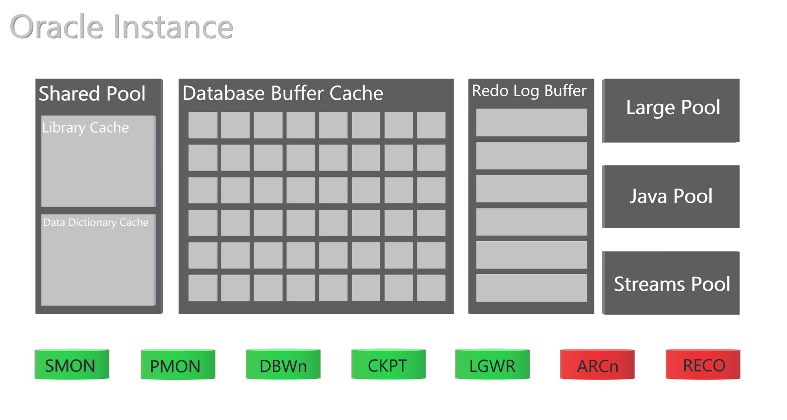
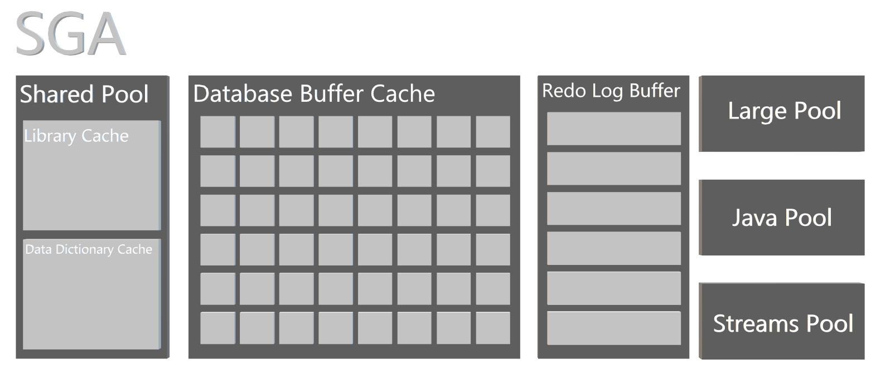
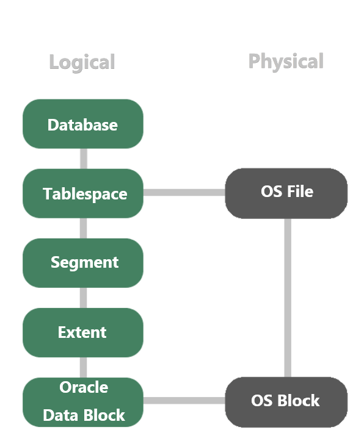
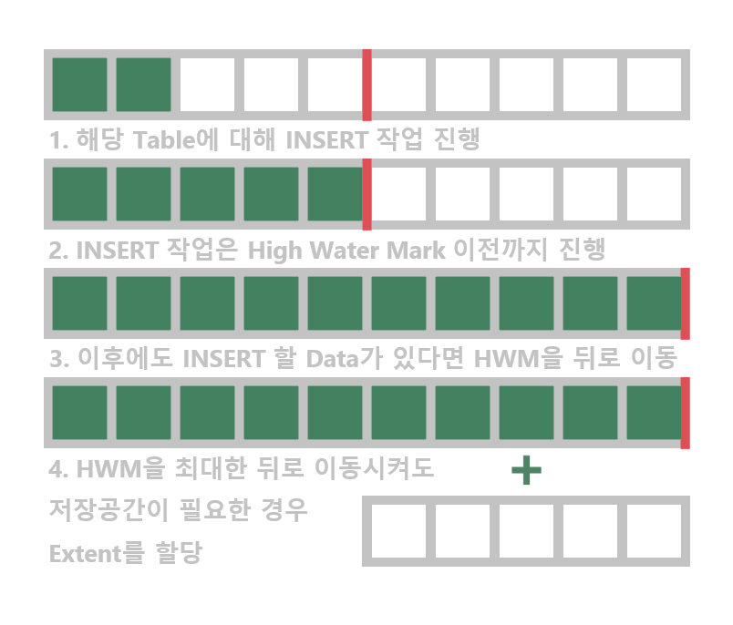
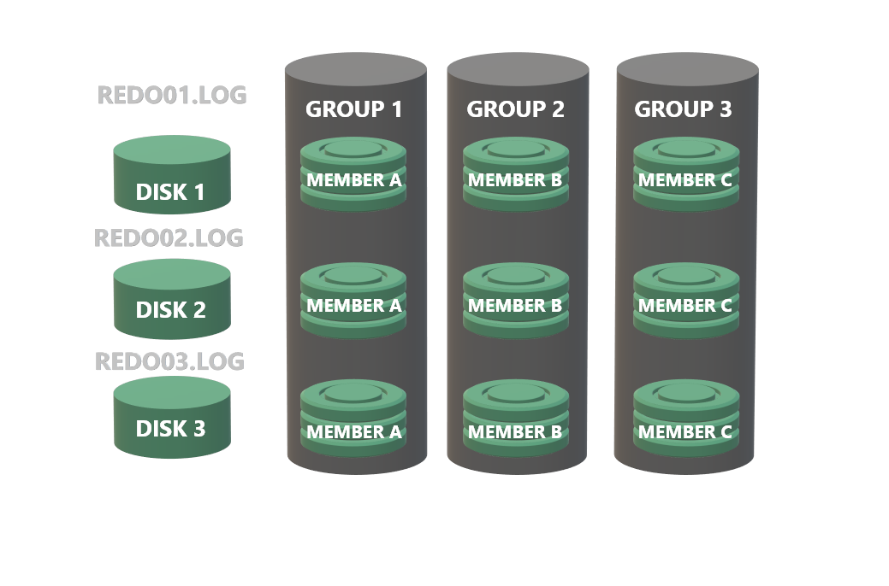

# Oracle Architecture

# Oracle Architecture

**Oracle Server = Oracle Instance + Oracle Database**

# Oracle Queuing Algorithm

- 기본적으로 Oracle은 Memory에서 LRU(Least Recently Used) List를 사용
- 사용 빈도가 높은 Buffer일수록 오래 DB Buffer Cache에 존재할 수 있는 Algorithm
- **`LRU 보조` -> `LRU 메인` -> `LRUW 메인` -> `LRUW 보조`**순으로 순환하며 버퍼를 탐색

## LRU List


- Dirty Buffer를 제외한 모든 Buffer를 관리
- 메인 리스트 : 사용된 버퍼들의 리스트가 hot, cold로 분류
- 보조 리스트 : 미사용된 버퍼나 DBWR에 의해 기록된 버퍼들의 리스트

## LRUW List

- 같은 Data Block에 대한 DB Buffer Cache에 저장된 Buffer Image와 Data File에 저장되어 있는
물리적인 Block Image가 서로 다른 Buffer들을 관리하는 List
- 메인 리스트 : 변경된 버퍼들의 리스트
- 보조 리스트 : DBWR에 의해 기록중인 버퍼들의 리스트

# Oracle Instance



**Oracle Instance = SGA + Background Process**

## SGA(System Global Area)

- SGA는 간단하게 오라클서버의 메모리영역
- SGA는 Oracle의 인스턴스에 대한 데이터와 제어 정보를 가지는 공유 메모리 영역의 집합
- 목적의 따라 오라클 파라미터 파일(init.ora)의 조정으로 SGA의 각 부분의 크기를 조절 가능
- Oracle9i부터 오라클 서버의 종료 없이 SGA의 구성을 SGA_MAX_SIZE 파라미터 값 범위 내에서만 각각의 크기를 동적으로 변경 가능
- Oracle 서버를 동시에 사용하고 있는 사용자는 시스템 글로벌 영역의 데이터 공유
- 전체 SGA를 실제 메모리 크기가 허용하는 범위에서 가장 크게 잡으면 디스크 I/O를 줄이고 메모리에 가능한 많은 데이터를 저장할 수 있으므로 최적의 성능을 낼 수 있음
- SGA는 공유 풀(Shared Pool), 데이터베이스 버퍼 캐시(DataBase Buffer Cache), 리두로그 버퍼(Redo Log Buffer) 이 세가지 와 LARGE POOL과 JAVA POOL, Streams Pool로 구성되어 있음



## Shared Pool

- Library Cache와 데이터 사전 캐시(Data Dictionary Cache)로 구성한다.
- 하나의 데이터베이스에 실행되는 모든 SQL 문을 처리하기 위해 사용한다.
- 문장 실행을 위해 그 문장과 관련된 실행 계획과 구문 분석 정보가 포함된다.
- 사이즈는 `SHARED_POOL_SIZE` 파라미터 값으로 결정한다.

### Library Cache

- 가장 최근에 사용된 SQL 문장의 명령문, 구문 분석 트리, 실행 계획 정보를 가진다.
- LRU 알고리즘으로 관리된다.
- Shared SQL과 Shared PL/SQL 영역으로 구분한다.
    - Shared SQL 영역: SQL문장에 대한 실행계획과 파싱 트리를 저장하고 공유한다.
    동일한 문장이 다시 실행되면 Shared SQL 영역에 저장되어 있는 실행 계획과 파싱 트리를 그대로 이용하기에 SQL 문장 처리 속도가 향상된다.
    - Shared PL/SQL 영역: 가장 최근에 실행한 PL/SQL 문장을 저장하고 공유한다.
    파싱 및 컴파일 된 프로그램 및 프로시져(함수, 패키지, 트리거)가 저장한다.

### Data Dictionary Cache

- 테이블, 컬럼, 사용자 이름, 사용 권한 같은 가장 최근에 사용된 데이터 사전의 정보를 저장한다.
- 구문 분석 단계에서 서버 프로세스는 SQL문에 지정된 오브젝트 이름을 찾아내고 접근 권한을 검증하기 위해 Dictionary Cache의 정보를 찾는다.

## DataBase Buffer Cache

- 가장 최근에 사용된 데이터를 저장하는 메모리 공간이다.
- 디스크에 완전히 쓰여지지 않는 수정된 데이터를 보유할 수도 있다.
- DB Buffer Cache에서 찾고 있으면 반환한다.(Logical Read)
- DB Buffer Cache에 없어서 Free Buffer를 확보 후 Disk에서 찾아 Cache하여 반환한다.(Physical Read)
- LRU 알고리즘에 의하여 가장 오래전에 사용된 것은 Disk에 저장, Memory에는 가장 최근에 사용된 데이터를 저장함으로, Disk I/O이 줄어들고, DBS의 성능이 증가한다.
    - LRU List: Buffer Block들의 상태를 관리하는 리스트이다.
        1. 많은 사용자가 동시에 Physical Read를 하여 동시에 DB Buffer Cache의 Free Buffer를 찾으려 할 때 LRU List 참조한다.
        2. 동시성 관리를 위해 순번 제공한다.(Latch)
        3. 본인 순번이 올 때까지 대기한다.
- Buffer Status
    - `Free`: 사용해도 되는 Buffer이다.
    - `Clean`: Buffer의 Data와 DB File 내의 Data가 일치하는 상태이다.
    - `Pinned`: 현재 사용중인 Buffer, 누군가 읽거나 변경하고 있는 상태이다.
    - `Dirty`: Buffer의 Data와 DB File 내의 Data가 일치하지 않는 상태이다.
- ~Oracle 8i: `DB_BLOCK_SIZE`와 `DB_BLOCK_BUFFERS`를 곱해 DB Buffer Cache의 크기를 결정
  Oracle 9i~: `DB_BLOCK_BUFFERS`를 Deprecated 시키고, `DB_CACHE_SIZE` 라는 파라미터가 도입
    - `DB_BLOCK_SIZE`: DB Buffer Cache의 블록 크기

## **오라클 9i에 변경된 Database Buffer Cache Parameter**

### Deprecated Buffer Cache Parameters

- `DB_BLOCK_BUFFERS`
- `BUFFER_POOL_KEEP`
- `BUFFER_POOL_RECYCLE`
    - 위 세 가지 파라미터는 예전 버전과의 호환을 위해 존재
    - Oralce 9i부터는 의미가 없어짐
    - Oracle 9i는 위의 파라미터들이 정의되어 있으면 위에 값들을 사용
        - Oracle 9i에 생성된 새로운 파라미터들을 사용하는 것이 좋음
            - `DB_BLOCK_BUFFERS`, `BUFFER_POOL_KEEP`, `BUFFER_POOL_RECYCLE` 값들을 사용시 Oracle 9i의 새기능인 Dynamic SGA 특징을 사용할 수 없음
            - initSID.ora 파일에 위 파라미터들과 새로운 파라미터를 동시에 기술시 에러 발생

### **New Buffer Cache Sizing Parameters**

- 세 가지 파라미터 추가
    - `DB_CACHE_SIZE`: 디폴트 버퍼 캐시, 반드시 존재해야 하며, 0으로 설정할 수 없음
    - `DB_KEEP_CACHE_SIZE`: Keep Buffer Cache의 크기, 재활용 가능성이 높은 블록을 저장하는데 사용
    - `DB_RECYCLE_CACHE_SIZE`: 재활용 버퍼 캐시 크기, 재활용 가능성이 낮은 블록을 즉시 제거하는데 사용
- 다른 점: 이전 버전의 경우 `DB_BLOCK_BUFFERS`, `BUFFER_POOL_KEEP`, `BUFFER_POOL_RECYCLE`에 정의된 값들이 BUFFER 개수
이제는 구체적인 메모리 크기를 지정함
- Oracle 9i부터는 Multiple Block Size(2K, 4K, 8K, 16K, 32K)를 지원
- DB_BLOCK_SIZE에 의해 정해진 BLOCK SIZE가 기본 BLOCK SIZE가 됨
SYSTEM TABLESPACE는 이 BLOCK SIZE를 이용

```sql
-- ALTER SYSTEM 명령으로 동적 변경 가능
**ALTER SYSTEM SET** DB_CACHE_SIZE=96M;
**ALTER SYSTEM SET** DB_KEEP_CACHE_SIZE=16M;
**ALTER SYSTEM SET** DB_RECYCLE_CACHE_SIZE=16M;
```

## Redo Log Buffer

- 데이터베이스에서 일어난 모든 변화를 저장하는 메모리 공간이다.
- 장애 발생 시 Recovery를 위해 존재한다.
    - 만약 Log를 남길 수 없는 경우에는 DB가 종료되거나 대기한다.

- Redo Log Buffer에 기록되지 않는 경우는 아래와 같다.
    - Direct Load
    - table이나 index의 nologging 옵션인 경우
        - table nologging 시 DML의 경우 제한적으로 Redo Log에 기록한다.
- DB에서 발생한 모든 변화는 LGWR에 의해 리두 로그 파일에 저장한다.
- Redo Log Buffer는 Database의 변경 사항 정보를 유지하는 SGA에 있는 Circular(순환) 버퍼이다.
- Redo Log Buffer의 크기는 Oracle Parameter `LOG_BUFFER`에서 지정한다.

## **Java Pool & Large Pool & Streams Pool**

### **Java Pool**

- 자바로 작성된 프로그램을 실행할 때 실행 계획을 저장하는 영역이다.
- `JAVA_POOL_SIZE` 파라미터로 관리되며, 기본 크기 24MB로 할당한다.

### **Large Pool**

- Oracle 백업 및 복원 작업에 대한 대용량 메모리 할당, I/O 서버 프로세스 및 다중 스레드 서버, Oracle XA에 대한 세션 메모리를 제공하는 SGA의 선택적인 영역이다.
- `LARGE_POOL_SIZE` 파라미터로 관리되며, 기본 크기는 0 byte이다.

### Streams Pool

- Oracle Streams 전용으로 사용되며 버퍼링된 Queue Message를 저장하고 Oracle Streams 캡처 Process 및 적용 Process에 대해 메모리를 제공하는 선택적인 영역이다.
- `STREAMS_POOL_SIZE` 파라미터로 관리되며, 기본 크기는 0 byte이다.

## Oracle 필수 Background Process

- Oracle DB가 시작되기 위해 꼭 필요하며 DB 종료 시 모두 종료됨

### SMON(System MONitor)

- Oracle Instance를 관리한다.
    - Instance Recovery 수행한다,
        - Startup 중 싱크 정보를 확인해 어긋날 경우 Redo Log Entires를 재실행 하여 서버의 싱크를 맞추는 과정이 Instance Recovery이다.
        - 인스턴스 복구는 저장되는 것까지 고려해야 한다.
        - 아래는 순서이다.
            1. DB  비정상 종료
            2. STARTUP
            3. MOUNT 단계에서 Data File의 SCN번호가 일치하지 않음 확인
            4. Roll Forward
                - Redo Log File의 정보를 Data File에 적용
            5. OPEN 단계에서 Roll Back
                - Undo Tablespace의 Undo Data를 사용해 Commit 되지 않은 내용 Roll Back
- 데이터 파일의 빈 공간을 연결해 하나의 큰 빈공간으로 만든다.
- 더 이상 사용하지 않는 임시 세그먼트 제거하여 재사용 가능하게 만든다.
- 오라클 인스턴스 fail시 복구하는 역할을 한다.

### PMON(Process MONitor)

- 오라클 서버에서 사용되는 각 프로세스들을 감시한다.
- 비정상 종료된 DB 접속을 정리한다.
- 정상적으로 작동하지 않는 프로세스를 감시해 종료하여 비정상적 종료된 프로세스들에게 할당된 SGA 리소스를 재사용 가능하게 만든다.
- 커밋되지 않은 트랜잭션을 `ROLLBACK`시킨다.

### DBWn(DataBase WRiter)

- DB Buffer Cache에 있는 Dirty Block의 내용을 데이터 파일에 기록한다.
- DB Buffer Cache내의 충분한 수의 Free Buffer가 사용 가능해진다.
- LRU 알고리즘을 사용한다.
- n은 숫자로 DB Writer를 여러개 구성 가능하다.
    - Default 1 or CPU_CONT/8 중 큰 쪽 1~100
    - `DB_WRITER_PROCESSES` Parameter를 통해 설정 가능하다.
    - 처음 36개의 DB Writer Process의 이름은 DBW0-DBW9 및 DBWa-DBWz,
    37~100번째 DB Writer Process의 이름은 BW36-BW99
    - 보통은 DBW0으로 충분하나 시스템에서 데이터를 많이 수정할 때 추가 Process를 구성 가능하다.
    - uniprocessor system(단일 프로세서 시스템)에서는 사용하지 않는다.
- 발생하는 이벤트는 아래와 같다.
    - Dirty Buffer 수가 임계값 도달
    - 프로세스가 지정된 개수의 블록을 스캔 하고도 Free Buffer를 발견하지 못했을 때
    - 시간 초과
    - CKPT가 발생 시
    - RAC ping이 요청되었을 때
    - Tablespace가 offline이나 read only로 변경되었을 때
    - TABLESPACE BEGIN BACKUP 명령 실행했을 때

### LGWR(LoG WRiter)

- DB Buffer Cache의 모든 변화를 기록한다.
- SGA의 Redo Log Buffer에 생겨나며 트랜잭션이 완료되었을 때 Redo Log Buffer의 내용을 Online Redo Log File에 기록한다.

### CKPT(ChecK PoinT)

- 모든 변경된 DB Buffer를 디스크 내의 데이터 파일로 저장하는 것을 보장한다.
- 변화된 데이터 블록 수, 일정 간격을 두어 DBWn이 Dirty Buffer를 데이터 파일로 저장하도록 명령한다.
- 발생시 데이터 파일과 컨트롤 파일의 헤더를 갱신한다.
- 관련 오라클 파라미터
    - `LOG_CHECKPOINT_TIMEOUT`: CKPT가 발생할 시간 간격 설정(단위: Sec)
    - `LOC_CHECKPOINT_INTERVAL`: CKPT가 발생할 Redo Log File의 블록 수 지정
- 발생하는 이벤트는 아래와 같다.
    - LOG SWITCH CHANGE
    - `LOG_CHECKPOINT_TIMEOUT`
        - 마지막 Redo Log 작성(tail of the log)으로 부터 설정한 시간(초 단위)
        - 해당 초 이후 Checkpoint 발생
    - `LOC_CHECKPOINT_INTERVAL`
        - Redo Log File Block 수로 Checkpoint 빈도 지정
        - DB Block이 아닌 OS Block 의 개수로 작동
        - 해당 OS Block 수 이후 Checkpoint 발생
    - SHUTDOWN
    - TABLESPACE OFFLINE

## 필수가 아닌 Process(Ark 제품과 관련있는 Process)

### ARCn(ARChiver)

- LOG SWITCH가 발생할 때 Redo Log File들을 지정된 저장장치로 저장
    - Online Redo Log File이 꽉 찼을 때 발생
    - DBA가 ALTER SYSTEM SWITCH LOGFILE의 명령어 실행
- n은 숫자로 Archiver를 여러개 구성 가능
    - Default 2, 1~30
    - 데이터의 벌크 로딩과 같은 무거운 워크로드가 많을 경우 여러 개 사용
    - `LOG_ARCHIVE_MAX_PROCESS`파라미터를 통해 설정 가능
- `ARCHIVELOG`모드 일 때만 작동

### RECO(RECOvery)

- DB 복구 시 시작되는 프로세스

## 나머지 프로세스

### LCKn(LoCK)

- Oracle 병렬 서버에서만 적용되며, 다수의 오라클 인스턴스 사이에서 Locking을 수행

### Pnnn(Parallel Query)

- Oracle 병렬 서버에서 병렬 질의를 제공

### Snnn(Shared Server)

- Multi Threaded Server구성에서 공유 서버를 제공(여러 클라이언트 요청에 응답)

### SNPn(SNaPshot Refresh)

- 자동으로 Snapshot Table을 갱신할 때 사용

### Dnnn(Dispatcher)

- 다수의 사용자 프로세스가 서버 프로세스를 공유하도록 하여 Multi Thread 구성 지원

### QMNn: Advanced Queuing

### LMON: RAC DLM Monitor.Global Locks

### LMDn: RAC DLM Monitor.Remote Locks

# User Process & Server Process

## User Process

- 사용자가 오라클 Application Program을 실행 시켰을 때 사용되는 프로세스이다.
- 아래는 예시이다.
  - SQL*Plus*
  - Forms
  - ProC
  - DataGrip
  - DBeaver

- 사용자가 오라클 서버에 접속할 때마다 사용자 프로세스가 생성된다.
- 사용자가 실행시킨 SQL문을 Server Process에 전달하고, 그 결과를 Server Process에게 받는다.

## Server Process

- Oracle은 Server Process를 생성하여 접속된 User Process의 요구 사항을 처리한다.
- User Process와의 통신과 요구 사항을 수행하는 Oracle과의 상호 작용 담당한다.
- Oracle은 Server Process당 User Process 수를 조정하도록 구성 가능하다.
- **전용 서버** 구성에서 Server Process는 단일 User Process에 대한 요구 사항을 처리한다.
- **공유 서버** 구성에서는 여러 개의 User Process가 적은 수의 Server Process를 공유하여 Server Process 수를 최소화하는 동시에 사용 가능한 시스템 자원 활용도를 최대화한다.
- 오라클 Server Process는 사용자로부터 받은 요구사항(SQL문)을 처리한다.
- 전달받은 SQL문을 Parse, Bind, Execute, Fetch 작업을 통해 실행시키는 역할 수행한다.

### Parse, Bind, Execute, Fetch

1. Parse - 동일한 쿼리인지 DB hit ratio 추가 검색한다.
    - SQL문 문법 검사
    - 사용자 인증 및 권한 검사
    - 객체의 사용 가능 여부 검사
2. Bind
    - bind 할 값이 있다면 값을 치환해 변수값을 적용해 Execute 과정으로 넘긴다.
    - 없을 경우 바로 Execute 과정으로 넘긴다.
3. Execute
    - Parse 과정에서 만들어진 Parse Tree로 원하는 데이터 찾는다.
    - DB Buffer Cache에서 데이터를 찾은 후 있다면 재사용한다.
    - DB Buffer Cache에 존재하지 않으면 Data File에서 필요한 Block 적재 후 사용한다.
    - 필요할 경우 데이터를 수정한다.
4. Fetch
    - 데이터를 User Process에게 전달한다.

# PGA(Program Global Area)


- 하나의 단일 프로세스에 대한 데이터와 제어 정보를 가지고 있는 메모리 공간이다.
- `PGA_AGGREGATE_TARGET` parameter 값을 통해 사이즈 조절 가능하다.
- USER PROCESS가 Oracle Database에 접속하고 Session이 생성될 때 Oracle에 의해 할당된다.
- 각 SERVER PROCESS에 하나만 할당한다.(1 : 1)
- 다른 프로세스와 공유되지 않는 독립적으로 사용하는 non-shared 메모리 영역이다.
- 세션 변수, 배열, 다른 정보를 저장하기 위해 스택 영역을 사용한다.
- PGA는 프로세스가 생성될 때 할당, 프로세스가 종료될 때 해제된다.
- PGA는 모드 구성에 따라 저장 위치가 다르다.
    - Dedicated Server
        - User Session Data, Cursor State, Sort Area 영역을 PGA 공간에 저장한다.
    - Shared Server
        - User Session Data 영역을 SGA에 저장한다.
- Memory가 가득 찰 시 Temp Tablespace로 간다.

## UGA

### User Session Data

- 추출된 결과 값을 전달하기 위해 User Process의 Session 정보를 저장
- SQL문 결과를 User Process에게 전달하기 위해 User Session Address 저장

### Cusor State

- 해당 SQL의 Parsing 정보가 기록되어 있는 주소 저장
    - 실행한 SQL문의 위치

### Sort Area

- 정렬시 사용하는 공간
- SQL의 작업 공간이며 가장 많은 공간 할당

## Stack Space

- SQL문에 Bind 변수를 사용할 때 저장하는 공간

# SELECT 흐름


1. Client가 SELECT절을 날리면 Server Process는 Shard Pool에 Library Cache를 확인해 Execute Plan이 있으면 Soft Parsing, 없을 경우 Optimizer가 Execute Plan을 만들어 Hard Parsing
2. Server Process는 DB Buffer Cache를 읽음
3. 없을 경우 Data File로부터 읽어와 DB Buffer Cache에 올림
4. 해당 결과를 Client에게 전달

# INSERT 흐름


1. Client가 INSERT절을 날리면 Server Process가 DB Buffer Cache에 데이터 담음
2. 데이터를 담을 때 LGWR는 변경내용을 Redo Log Buffer에 담음
3. Redo Log Buffer에 담긴 내용은 commit이나 특정 시간마다 LGWR가 Redo Log File에 내림
4. DBWn는 Checkpoint 발생 시 DB Buffer Cache상에 모든 Dirty Buffer를 Data File에 저장

# UPDATE 흐름


- 위 INSERT와 유사하나 DB Buffer Cache에 담을 때 Undo Block에 이전 값을 저장해 놓음
    - ex) UPDATE emp SET sal = 1000 WHERE empno = 30 AND sal = 500
        - Undo Block: rowid = ?, sal = 500
        - Redo Log Buffer: rowid = ?, old value = 500, new value = 1000
1. Client가 UPDATE절을 날리면 Server Process가 DB Buffer Cache에 데이터 담음
2. 데이터를 담을 때 LGWR는 변경내용을 Redo Log Buffer에 담고, Undo Block에 이전값을 담음
3. Redo Log Buffer에 담긴 내용은 commit이나 특정 시간마다 LGWR가 Redo Log File에 내림
4. DBWn는 Checkpoint 발생 시 DB Buffer Cache상에 모든 Dirty Buffer를 Data File에 저장

# Oracle Database

**Oracle Database = Data Files + Control Files + Redo Log Files**

- DB 이름으로 식별
- DB 이름을 Instance의 이름과 다르게 지을 수 있음

## Data Files

- 실제 데이터가 저장되는 하드디스크상의 물리적 파일
- 테이블이나 인덱스 같은 DB의 논리적 구조는 DB를 위해 할당된 Data Files에 물리적으로 저장
- 생성시 그 크기를 명시하고 더 필요할 경우 확장 가능
- Oracle에 의해 생성 및 삭제 되어야 함(운영 체제 명령으로 삭제 및 이동 금지)



물리 구조와 논리 구조

### Block

- 실제 데이터가 기록됨
- Block Header에는 Block을 관리하기 위한 데이터가 있음
- Oracle에서 공간을 할당하는 최소 단위
- 크기는 2, 4, 8, 16, 32KB 등 다양
- Oracle Data Block 한 개는 OS Block이 한 개 이상 모여 생성

### Extent

- 여러 개의 연속된 Block 집합
- Table에 데이터가 없더라도 자동 할당되며 최초 값 다 사용 시 추가로 생성
- Extent의 크기는 Segment 생성 시 `STORAGE`라는 Parameter를 통해 수동으로 지정 가능
- 생략 시 Tablespace의 기본 설정 값 적용 받음(최소 64KB)
- Table 별로 Block의 구역을 나눠 저장해 검색 범위를 줄이기 위해 Extent 사용

### Segment

- Extent들의 집합
- Table, Index, Undo, Temp처럼 저장 공간을 필요로 하는 Object
- Segment의 여러 Extent  중 가장 첫번째의 첫 Block에 Segment Header 존재
- Segment Header에 해당 Segment의 종류에 대한 정보가 들어가며 Extent의 할당 상태와 공간 사용 내역이 들어가게 됨

### Tablespace

- Segment들의 집합
- Table이 존재하는 공간

### High Water Mark



- Segment의 Header에 존재, 모든 Segment에 하나씩 존재
- 저장 공간을 갖는 Segment 영역에서 사용한 적이 있는 Block과 사용한 적 없는 Block의 경계점
- HWM 이전 블록에만 저장 가능
- 데이터를 계속 넣으면 High Water Mark가 증가(제거해도 떨어지지 않음)
- DB는 HWM까지 데이터블록 전체를 스캔
- PRIMARY KEY 혹은 UNIQUE KEY 지정을 통해 자동으로 생성되는 INDEX에는 소용 없음
- Drop이나 TRUNCATE를 통해 Table을 초기화 시켜 불필요한 I/O를 줄임

| 명령어 | 종류 | 설명 | RollBack 여부 | HWM 여부 |
| --- | --- | --- | --- | --- |
| DELETE | DML | 데이터 삭제 | 가능(COMMIT이전) | 유지 |
| TRUNCATE | DDL | 테이블 초기화 | 불가 | 해제 |
| DROP | DDL | 테이블 삭제 | 불가 | X |

### Data Block의 옵션

- `INITRANS`: Block이 생성될 때 동시 접근 가능한 트랜잭션의 슬롯 개수 지정
트랜잭션이 많이 발생하면 `MAXTRANS`까지 늘어나며 `PCTFREE`로 확보된 영역에 추가 확장
`INITRANS`값을 크게 설정하면 블럭 공간이 감소
- `MAXTRANS`: Block에 접근 가능한 최대 트랜잭션 개수
트랜잭션의 수가 `MAXTRANS`을 초과할 때 앞 트랜잭션이 `COMMIT` or `ROLLBACK`해야 사용 가능
- `PCTUSED`: Block 재사용 여부 결정 Default = 40%  지정값 이하의 Block 사용량이면 저장 가능
  `PCTUSED`가 높으면 공간 활용도는 높아지나 Free List에 등록 제거를 반복해 처리 비용 증가
    - Free List: 데이터가 입력될 수 있는 Block List
- `PCTFREE`: Block Row Data의 길이가 늘어날 것을 대비하는 여유 공간 설정 Default = 10%
  `PCTFREE`가 높으면 Row Migration과 같은 문제를 줄이나 저장 공간이 줄어 비효율적
    - Row Migration: `UPDATE`로 인해 행 길이가 증가했을 때 저장 공간이 부족하면 발생
      원래 정보를 기존 Block에 남겨두고 실제 데이터는 다른 Block에 저장
    - Row Chaining: 데이터가 커 여러 블록에 나누어 저장하는 현상

## Control Files

- DB의 제어 정보를 가지고 있는 파일
- DB 이름이 Control File에 저장됨
- Oralce DB를 `MOUNT`, `OPEN`하여 사용하는데 필수적(Control File을 백업해놓는 것이 좋음)
- Binary File이라 직접 접근 불가능

## Redo Log Files

- DB의 모든 변화를 기록하는 파일
- 수정 내용을 Data Files에 반영하지 못해도 변경 사항이 저장되어 있어 유식되지 않음
- DB 장애를 보호하기 위해 필수적
- 데이터 복구에 사용
- SGA 내의 Redo Log Buffer Cache에 저장된 데이터들은 Redo Log Buffer가 일정 수준 이상 채워질 때 LGWR에 의해 Redo Log File로 저장됨
- 적어도 두개 이상의 그룹을 가지며 한 그룹 내 각 멤버들은 모두 동일한 데이터를 가짐



- Redo Log File Group이 가득 찼을 때 LGWR은 다음 그룹에 기록함(Log Switch)
- Online Redo Log File과 Archived Redo Log File이 있음
    - Online Redo Log File: 모든 변경사항을 저장하는 공간, 복구를 위한 필수적인 공간
    - Archived Redo Log File: Online Redo Log File가 덮어쓰이기 전 반영구적 보관을 위해 백업
    선택적인 공간
- Redo Log File 상태
    - `UNUSED`: 생성 이후 사용하지 않은 상태
    - `CURRENT`: 현재 Redo Log File을 LGWR이 내용을 기록하는 상태(활성 상태)
    - `ACTIVE`: 데이터가 찼으나 디스크에 저장하지 않은 상태(활성 상태)
    - `INACTIVE`: 데이터를 디스크에 저장하여 삭제되어도 되는 상태(비활성 상태)
    - `CLEARING`: 초기화 상태, 이후 `UNUSED` 상태로 변경됨
    - `CLEARING_CURRENT`: `CURRENT`상태에서 초기화가 진행중인 상태
    이후 `UNUSED` 상태로 변경됨
- 순환형으로 사용 → 재사용한다는 뜻
    - Group은 최소 2개 이상 존재
    - Group당 Member가 최소 1개 이상 존재
    - Oracle 권장
        - Group = 3개, Member = 2개

# SCN

- System Commit Number
- `commit` 발생 시 Transaction이 부여받는 고유한 번호
- Instance Recovery때나 USER가 `RECOVER` 명령을 수행할 때 DB에 문제가 있는지 판단하는 지표
- DB를 다시 생성하지 않는 이상 RESET되지 않음
- SCN Base(4 bytes) + SCN Wrap(2 bytes)로 구성
- Sequence에서 발상하는 것이 아니라 kcmgas라는 function에서 구현

## SCN 기록 Solution

1. Control File Header
    - Checkpoint 발생 시
    - Resetlogs 발생 시
    - Incomplete Recovery 수행 시
2. Data Blocks(Cache Layer)
    - Block Cleanout 시 마지막 SCN을 각 Block에 기록
3. Data Blocks(ITL entires)
    - Data Block의 Transaction Layer 안에 있는 Interested Transaction List Entries에 `commit`된 SCN 정보 기록
4. Data File Headers
    - 마지막 Checkpoint 발생 시
    - Begin Backup 수행 시
    - Recovery 되었다면 사용자의 마지막 SCN 기록
5. Redo Records / Log Buffer
    - `commit`  수행 시 commit record에 SCN을 포함하여 저장
6. Rollback Segment(Undo Segment)와 Tablespace Headers에도 기록